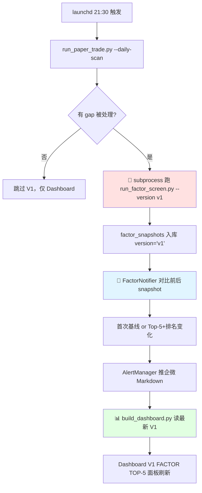

# dev-09 多因子选股规划

> **背景**：阶段6 [[dev-04-回测记录]] 中 MA+量能、RSI+MA50 升级 A/B 显示，**单指标+单确认层架构的天花板就是年化 5-10%**。要真正跑赢 QQQ（年化 ~18%），必须升级到**多因子打分选股**。
>
> **状态**：设计文档，等阶段7 Paper Trading 跑 2-4 周后基于真实数据决定是否启动。

---

## 1. 设计目标

| 维度 | 当前（阶段5-6） | 多因子目标（阶段8） |
|------|---------------|------------------|
| 选股逻辑 | 9 只 watchlist 全跑，策略各跑各的 | **每日打分 → Top5 持仓** |
| 信号生成 | 单指标判断 | **多因子加权综合** |
| 仓位决策 | 按策略 risk_pct 算 | **按打分高低 + Kelly 简化版** |
| 持仓周期 | 信号驱动（不固定）| **周/月度再平衡** |
| 预期年化 | 5-10% | **15-20%（目标）** |
| 最大回撤 | 13-15% | **<= 20%（放宽）** |

---

## 2. 因子体系（5 维度，每维度 100 分）

### 2.1 价值因子（Value）— 占 20%

| 子因子 | 计算 | 数据源 | 方向 |
|--------|------|--------|------|
| PE 倒数 | 1 / PE Ratio | LongPort fundamentals | 越高越好 |
| EV/EBITDA | 企业价值 / 息税折旧前利润 | LongPort | 越低越好 |
| Free Cash Flow Yield | FCF / Market Cap | LongPort | 越高越好 |

**说明**：科技股 PE 普遍偏高，Value 权重不宜过大；可在配置层按行业差异化。

### 2.2 质量因子（Quality）— 占 20%

| 子因子 | 计算 | 数据源 | 方向 |
|--------|------|--------|------|
| ROE | 净资产收益率 | 财报 | 越高越好 |
| ROA | 总资产收益率 | 财报 | 越高越好 |
| 净利润率 | Net Margin | 财报 | 越高越好 |
| 负债率 | Debt-to-Equity | 财报 | 越低越好 |

### 2.3 动量因子（Momentum）— 占 25%

| 子因子 | 计算 | 数据源 | 方向 |
|--------|------|--------|------|
| 6M Return | 过去 126 日收益率 | K线 | 越高越好 |
| 3M Return | 过去 63 日收益率 | K线 | 越高越好 |
| 12M-1M | 过去 12 月扣去最近 1 月（剔除反转）| K线 | 越高越好 |

**学术依据**：Jegadeesh-Titman (1993) 经典动量论文，6-12月动量在美股长期有效。

### 2.4 技术因子（Technical）— 占 20%

| 子因子 | 计算 | 数据源 | 方向 |
|--------|------|--------|------|
| MA 趋势 | Price > MA50 ? +1 : -1 | K线 | 趋势向上 |
| RSI 健康度 | 30 < RSI < 70 ? 满分 : 衰减 | K线 | 不极端 |
| MACD 信号 | Hist > 0 ? +1 : -1 | K线 | 多头 |
| ADX 强度 | ADX > 25 ? 趋势市 | K线 | 越强越好 |

### 2.5 流动性 + 波动率（Liquidity & Risk）— 占 15%

| 子因子 | 计算 | 数据源 | 方向 |
|--------|------|--------|------|
| 日均成交额 | 20日 turnover 均值 | K线 | 越高越好（避免流动性陷阱）|
| 历史波动率 | 60日收益率标准差 | K线 | 越低越好（同收益首选低波） |
| Beta | 相对 SPY 60日 Beta | K线 + SPY | 中性偏低 |

---

## 3. 评分归一化方案

### 3.1 单因子归一化

对每个因子在**全市场样本**内做 **Z-Score**，然后映射到 [0, 100] 分：

```python
def normalize_factor(values: pd.Series) -> pd.Series:
    """Z-Score 归一化 + Sigmoid 映射到 [0, 100]"""
    z = (values - values.mean()) / values.std()
    # Sigmoid: 1 / (1 + exp(-z))
    return 100 / (1 + np.exp(-z))
```

**为什么用 Sigmoid 不用 MinMax**：
- MinMax 受极值影响大（一只异常股票拉高/拉低整体）
- Z-Score 反映相对位置
- Sigmoid 把 ±2σ 之外的极端值压平，避免单因子主导

### 3.2 大类聚合 + 加权

```
total_score = (
    value_score * 0.20 +
    quality_score * 0.20 +
    momentum_score * 0.25 +
    technical_score * 0.20 +
    liquidity_risk_score * 0.15
)
```

**权重可配置**（`config/multifactor.yaml`）：
- 防御型组合：Quality 30%、Value 25%、Momentum 15%
- 进攻型组合：Momentum 35%、Technical 25%、Quality 15%
- **默认：均衡组合**（上面给的权重）

---

## 4. 选股 + 持仓管理流程

### 4.1 每日打分

```
盘后 → 拉取最新财报/价格 → 跑 5 大类因子 → 归一化 → 加权 → 总分排行
```

### 4.2 持仓决策（周度再平衡）

```python
# 每周一收盘后执行
def rebalance(scores: pd.DataFrame, current_positions: dict) -> List[Trade]:
    top5 = scores.nlargest(5, "total_score")

    # 当前持仓 vs 新 top5
    keep    = set(current_positions.keys()) & set(top5.index)
    sell    = set(current_positions.keys()) - set(top5.index)
    buy     = set(top5.index) - set(current_positions.keys())

    # 按打分 Kelly 简化版分配仓位
    weights = top5["total_score"] / top5["total_score"].sum()
    target_value = portfolio_value * weights

    return generate_trades(keep, sell, buy, target_value)
```

### 4.3 风控集成

- **单票上限**：最大 30%（避免重仓单只）
- **现金缓冲**：保留 10% 不投
- **熔断**：跟阶段5 一致（20% 回撤暂停）
- **止损**：依然走 ATR-442（多因子选股不代表不需要止损）

---

## 5. 实施路径（4 周渐进）

### Week 1：数据接入
- [ ] 接入 LongPort 财报 API（fundamentals）
- [ ] 新增 `src/data/fundamentals_fetcher.py`
- [ ] SQLite 增加 `fundamentals` 表
- [ ] 单测：拉取 9 只 watchlist 的 PE/ROE/Margin

### Week 2：因子计算
- [ ] 新增 `src/strategy/factors/` 子模块
- [ ] 每个因子一个 py 文件：`value.py` / `quality.py` / `momentum.py` / `technical.py` / `liquidity.py`
- [ ] 归一化工具 `src/strategy/factors/normalizer.py`
- [ ] 单测：每个因子用 mock 数据验证

### Week 3：选股引擎
- [ ] `src/strategy/multifactor_selector.py`：聚合打分 + Top5 选股
- [ ] `config/multifactor.yaml`：权重 + 阈值配置
- [ ] 回测：MultiFactorSelector 接入现有 `BacktestEngine`，对比 buy-and-hold QQQ
- [ ] **决策门槛**：年化 ≥ 12% 且 MaxDD ≤ 22% 才算合格

### Week 4：再平衡 + Paper Trading
- [ ] `RebalanceScheduler`：周一收盘触发再平衡
- [ ] 接入 Paper Trading：把 multifactor 加入 active_strategies
- [ ] 跑 2 周观察真实持仓变化

---

## 6. 关键技术挑战

| 挑战 | 风险 | 缓解措施 |
|------|------|---------|
| 财报数据更新滞后 | 因子打分用过期数据 | 每天检查 `last_filed_date`，超期降权 |
| 行业差异巨大 | 用全市场归一化对科技股不公平 | 按行业分组后归一化（Z-Score within sector）|
| 因子失效 | 历史有效不代表未来有效 | 每月重跑因子 IC（Information Coefficient）检验 |
| 换手率过高 | 周度再平衡可能频繁交易 | 加 turnover 缓冲：分数变化 < 5% 不调仓 |
| Survivorship Bias | 只看现在的 9 只标的有幸存者偏差 | 实施时扩大到 SP500 / NASDAQ100 全样本 |

---

## 7. 与现有架构的关系

```
BaseStrategy（保留）
  ├── MACrossStrategy（保留，作为 fallback）
  ├── RSIStrategy（保留）
  ├── MomentumStrategy（保留）
  └── MultiFactorStrategy（阶段8 新增）
        └── 内部组合 5 个因子
        └── 输出 Top5 持仓建议而非"买/卖"信号
```

**关键设计**：`MultiFactorStrategy` 作为**新策略类型**接入，**不破坏**现有单因子策略。可以并行运行 → A/B 对比谁的真实 PnL 更好。

---

## 8. 推迟到阶段8 的理由

1. **数据准备复杂**：需要先接入 LongPort 财报 API（阶段7 还没做）
2. **真实数据驱动**：Paper Trading 跑 2-4 周后能让我们知道：
   - 哪些指标在我们的 watchlist 里真的有信号
   - 实际换手率/滑点是多少
3. **风险隔离**：先验证现有架构的稳定性，再叠加复杂逻辑

---

## 9. 触发条件（什么时候启动阶段8）

- ✅ Paper Trading 跑满 2 周（10 个交易日）
- ✅ 至少 5 笔成交，可统计胜率/滑点
- ✅ 监控告警链路无误报
- ✅ 多因子设计经 Gavin Review 确认

满足后即可启动 Week 1 数据接入。

---

## 10. 参考资料

- Jegadeesh & Titman (1993) "Returns to Buying Winners and Selling Losers"
- Fama & French (1993) "Common Risk Factors in Returns on Stocks and Bonds"
- AQR "Quality Minus Junk" (2014)
- 学习笔记 [[ln-05-多因子模型基本面分析]] —— 已有理论基础

---

_文档状态：设计完成，等阶段7 验证后启动实施。_

---

# 📦 V0 实施记录（2026-04-25 凌晨）

## 实施背景

Gavin 在阶段 8 完工后主动要求启动阶段 9，1.5h 限时端到端打通。
因完整 5 因子模型需要财报数据，本次 V0 做"可行性验证版"。

## 数据能力盘点（关键发现）

> [!warning] LongPort SDK 无财报 API
> - `QuoteContext` 46 个方法中**没有** `income_statement / balance_sheet / cash_flow`
> - 原设计的 Quality 因子（ROE、营收增速、净利润率）V0 无法实现
> - 等未来集成 yfinance / Polygon 等财报源后再补

> [!success] LongPort `calc_indexes` 覆盖 7 个因子指标
> 经测试确认以下字段可用且一次请求批量返回：
> - `PeTtmRatio`、`PbRatio`、`DividendRatioTtm`（Value）
> - `TotalMarketValue`（Size）
> - `FiveDayChangeRate`、`HalfYearChangeRate`（Momentum）
> - `TurnoverRate`（Liquidity）

## V0 架构（4 因子）

| 因子 | 权重 | 指标 | 方向 |
|------|------|------|------|
| Value | 25% | PE TTM(-) + PB(-) + Dividend(+) | 便宜 + 高分红好 |
| Momentum | 30% | 5日涨幅(+) + 半年涨幅(+) | 涨得多好 |
| Size | 15% | log10(市值)(-) | 偏中小盘 |
| Liquidity | 30% | 换手率(-) | 避免过热炒作股 |

**关键技术点**：
1. **Winsorized Z-Score**：先用 5%-95% 分位数截断极端值，再 Z-Score，最后 clip 到 [-3, 3]
   - 28 样本量下避免单个异常值扭曲标准差
2. **PE < 0 当缺失处理**：亏损公司不应被当成"便宜"
3. **log 转 Size**：市值单位差异大（万亿 vs 百亿），log 后再归一化
4. **NaN 填 0**：缺失数据给中性分（不排除标的）

## V0 验证结果（首次运行 2026-04-25 00:13）

**Top-10（共 28 标的打分）**：

| Rank | Symbol | Score | 亮点 | 是否持仓 |
|------|--------|-------|------|---------|
| 1 | XOM | +0.66 | Value 0.97（便宜+高股息）| - |
| 2 | GS | +0.60 | Value 0.80 + Size 1.06 | - |
| 3 | CAT | +0.59 | Momentum 1.59（半年强势）| - |
| 4 | KO | +0.50 | 全面均衡，稳健 | - |
| 5 | TSM | +0.49 | Momentum 1.89 | **✅ 在持** |
| 6 | JNJ | +0.40 | Value + Liquidity 中上 | - |
| 7 | MCD | +0.36 | Value 0.90 | - |
| 8 | BAC | +0.33 | Value 1.01（最便宜）| - |
| 9 | JPM | +0.32 | 金融低估值 | - |
| 10 | WMT | +0.25 | 消费龙头 | - |

**现持仓 5 只在多因子中的表现**：

| 持仓 | 多因子 Rank | 总分 | 结论 |
|------|-------------|------|------|
| TSM | #5 | +0.49 | ✅ 多因子也看好 |
| AVGO | #17 | -0.18 | ⚠️ 中下游 |
| META | #20 | -0.24 | ❌ 偏弱 |
| MSFT | #22 | -0.34 | ❌ 偏弱 |
| NVDA | #24 | -0.38 | ❌ 偏弱 |

**关键洞察**：
1. Momentum 策略买的大盘科技股，在多因子中因 **Size 反向 + Value 差**而排名靠后
2. 这不代表"策略错了"，而是**不同体系偏好不同**
3. 两种体系可以**组合使用**：Momentum 抓趋势 + 多因子做价值轮动池

**Bottom 5（合理性检查）**：
- TSLA -1.05（Value 最差 -1.45）✓ 合理
- QQQ -0.62（Liquidity 因换手率高被打压，ETF 副作用）⚠️ 需修
- NVDA/AAPL 在 Bottom 反映 Value 因子严格（PE 高 → 打压）

## 已知问题（V0 遗留）

> [!bug] ETF Liquidity 异常
> QQQ / SPY / IWM 的换手率天然高（ETF 特性），被 Liquidity 因子严重打压。
> 未来版本应：
> 1. 识别 ETF 标的豁免 Liquidity 因子，或
> 2. 把 watchlist 分为"股票组 + ETF 组"分别打分

> [!todo] 缺少 Quality 因子
> 接入 yfinance 的 ticker.info（含 returnOnEquity / profitMargins 等）可补足。
> 需评估是否引入新依赖。

## 交付物

| 文件 | 行数 | 说明 |
|------|------|------|
| `src/factor/__init__.py` | 18 | 模块入口 |
| `src/factor/factor_fetcher.py` | 95 | 数据采集 |
| `src/factor/factor_scorer.py` | 210 | 核心打分逻辑（含 winsorized Z-Score）|
| `src/data/longport_client.py` | +80 | 新增 fetch_calc_indexes 方法 |
| `src/data/database.py` | +120 | 新增 factor_snapshots 表 + 读写方法 |
| `scripts/run_factor_screen.py` | 240 | CLI 入口 |
| `output/factor_screen_YYYY-MM-DD.csv/.md` | - | 每次运行产出 |

总计约 **760 行新代码**。

## 升级路径（周末/下周可做）

按优先级排序：

1. **回测验证**（推荐最先做）：Top-10 标的 30 日前瞻回报 vs 基准，看因子有没有 alpha
2. **ETF Liquidity 豁免**（30 min）
3. **接 Quality 因子**（yfinance，1-2h）
4. **集成到 daily-scan**（与 per_symbol 并行产生建议）
5. **组合优化**（从打分到持仓的转换，含再平衡）

## 关联

- [[dev-04-回测记录]] - 96 次 A/B 回测是 per_symbol 的基础
- [[dev-08-监控与运维]] - 未来 Dashboard 会加多因子面板
- [[ln-05_多因子模型基本面]] - 理论来源

**状态**：V0 已落地，等 Paper 再跑 1-2 周 + 多因子 V1（加 Quality）一起进阶段 9.5。

---

# 🚀 V1 实施记录（2026-04-25 下午）

## 背景

Gavin 凌晨看完 V0 Top-10 反馈：
1. "AI 驱动时代 PE 低不等于好"——认为 Value 25% 偏重
2. "偏好科技/AI 热点"——希望 Momentum 提权 + 行业加权
3. "Bottom-5 不完全认可"——QQQ 被 Liquidity 误伤明显
4. 实盘持仓 MSFT/META/NVDA/TSM/AVGO 等科技蓝筹，但现 watchlist 缺半导体纵深

## 需求澄清（2 轮 Q&A）

### 关键决策
- **Watchlist 扩容**：28 → 35（新增 ORCL/PLTR/SMCI/MU/MRVL/QCOM/INTC）
- **Quality 因子**：启用（净利率+毛利率+营业利润率+ROE）
- **Industry 因子**：启用（半导体 +1.0σ，AI 基建 +0.8σ，软件互联网 +0.7σ）
- **ETF 特殊通道**：SPY/QQQ/IWM 跳过 Quality/Liquidity/Industry
- **权重调整**：Value ↓10%、Momentum ↑5%、Size ↓10%、Liquidity ↓15%、Quality +15%、Industry +15%

## 数据源选型之路（踩坑记录）

| 候选 | 结果 | 备注 |
|------|------|------|
| FMP 免费档 | ❌ 59% 覆盖 | 半导体核心 MU/MRVL/QCOM/SMCI 全 402 Premium |
| FMP v3 endpoint | ❌ 403 | 2025 改版后新账户必须用 /stable |
| yfinance | ❌ rate limited | IP 被 Yahoo 限流，白天也不行 |
| Alpha Vantage 免费 | ❌ 25 次/天 | 不够 35 只 |
| SEC EDGAR | ⚠️ 需 +3h 开发 | XBRL 原始数据解析复杂 |
| **westock-data** | ✅ **选中** | 腾讯自选股 CLI skill，100% 覆盖 + 真 ROE + 无限调用 |

## V1 架构

### 因子权重对比

| 因子 | V0 | V1 | 变化原因 |
|------|-----|-----|---------|
| Value | 25% | **15%** | -10%：AI 时代低 PE ≠ 好 |
| Momentum | 30% | **35%** | +5%：体现"动量优先"偏好 |
| Quality | 0% | **15%** | 新增 |
| Size | 15% | **5%** | -10%：AI 大公司也很强 |
| Liquidity | 30% | **15%** | -15%：修 ETF 误伤 |
| Industry | 0% | **15%** | 新增 |

### Quality 子因子（100% 用 Westock）
- NetMargin 30%：净利率（NVDA 55.8% / LLY 31.7% / MU 22.8%）
- GrossMargin 20%：毛利率（NVDA 75.0% / LLY 83.0%）
- OperatingMargin 20%：营业利润率
- ROE 30%：真 Quality 核心（NVDA 119% / LLY 101% / QCOM 23.3%）

### Industry σ 映射（实测 FMP /stable/profile 校准拼写后）
| 分类 | bias | 覆盖标的 |
|------|------|---------|
| 半导体核心 | +1.0σ | NVDA/AMD/TSM/AVGO/MU/MRVL/QCOM/INTC |
| AI 基建硬件 | +0.8σ | SMCI（Westock 数据缺失时 fallback）|
| 软件/互联网 | +0.7σ | MSFT/GOOGL/META/ORCL/PLTR |
| 消费电子 | +0.3σ | AAPL |
| 娱乐/电商/其他 | 0σ | NFLX/AMZN/TSLA |
| 非科技 | 0σ | 金融/医药/能源/消费 |

### ETF 特殊通道
SPY/QQQ/IWM 跳过 Quality/Liquidity/Industry，只用 **Value 30% + Momentum 50% + Size 20%**。
修复 V0 的 ETF 天然换手率高被误伤的 bug（QQQ 从 V0 的 -2.70 Liquidity → V1 正常 0.00）。

## 实施结果

### V1 Top-10（2026-04-25）

| Rank | Symbol | 总分 | Quality | Industry | Momentum | 亮点 |
|------|--------|------|---------|----------|----------|------|
| 1 | **MU** | +0.65 | -0.28 | +1.0 | +1.96 | 半导体存储+强势动量 |
| 2 | **TSM** | +0.59 | +0.91 | +1.0 | +0.79 | 半导体代工王 |
| 3 | **INTC** | +0.55 | -1.25 | +1.0 | +2.55 | 动量极强（反弹）|
| 4 | **MRVL** | +0.53 | -1.21 | +1.0 | +2.32 | 数据中心芯片 |
| 5 | IWM | +0.52 | - | - | +0.47 | ETF 小盘反弹 |
| 6 | CAT | +0.32 | -0.43 | 0.0 | +0.94 | 工业动量 |
| 7 | **GOOGL** | +0.26 | +0.41 | +0.7 | +0.24 | 互联网巨头 |
| 8 | **NVDA** | +0.26 | +1.96 | +1.0 | +0.04 | Quality 顶级 ROE 119% |
| 9 | KO | +0.25 | +0.39 | 0.0 | -0.09 | 稳健消费 |
| 10 | JNJ | +0.20 | +0.33 | 0.0 | -0.18 | 稳健医药 |

### V0 vs V1 对照
- **V1 新进**：MU(#1)/TSM(#2)/INTC(#3)/MRVL(#4)/NVDA(#8)/GOOGL(#7)/IWM(#5)
- **V0 掉出**：BAC/GS/JPM/MCD/WMT/XOM（全部是非科技股）
- 完美体现"AI 热点偏好"

### 回看回测结果（29 交易日 vs QQQ +6.50%）

| 指标 | V1 Top-10 | V0 Top-10 | 赢家 |
|------|-----------|-----------|------|
| 累计收益 | **+13.70%** | +11.96% | V1 ✅ |
| 超额收益 | **+7.21%** | +5.46% | V1 ✅ |
| Alpha | +5.25% | **+6.04%** | V0 ✅ |
| Beta | 1.30 | **0.91** | V0 ✅ |
| Sharpe | 3.57 | **4.20** | V0 ✅ |
| 最大回撤 | -8.53% | **-4.81%** | V0 ✅ |
| 胜率 | **65.5%** | 62.1% | V1 ✅ |

**结论**：
- 两者都有显著 alpha，因子体系**都有效**
- V1 收益更高但波动更大（Beta 1.30）
- V0 风险调整收益更好（Sharpe 4.20，Alpha 反而更高）
- **选 V0 还是 V1 取决于风格偏好**——激进派选 V1，稳健派选 V0

## 交付物

### 新代码
| 文件 | 行数 | 说明 |
|------|------|------|
| `src/data/fmp_client.py` | 370 | FMP 备份数据源（未启用）|
| `src/data/westock_client.py` | 360 | Westock CLI 封装（主数据源）|
| `src/factor/industry_map.py` | 180 | 中文/英文/硬编码三级行业映射 |
| `src/factor/v1_scorer.py` | 230 | V1Scorer 六因子打分 + ETF 通道 |
| `scripts/download_v1_kline.py` | 120 | 7 新标的 K 线下载 |
| `scripts/backtest_factor_screen.py` | 330 | 回看回测 |
| **合计** | **~1600 行** | |

### 修改
| 文件 | 说明 |
|------|------|
| `src/data/database.py` | migration + factor_snapshots 加 version 字段 + ROE 字段 |
| `src/factor/__init__.py` | 导出 V1Scorer/get_industry_bias |
| `src/factor/factor_fetcher.py` | 新增 fetch_v1 合并双数据源 |
| `scripts/run_factor_screen.py` | 支持 --version v0/v1 切换 + V1 专属 Markdown 渲染 |
| `config/strategies.yaml` | watchlist 扩 7 只 + per_symbol 映射 |

### 产出
- `output/factor_screen_2026-04-25_v1.csv/.md`
- `output/factor_screen_2026-04-25.csv/.md`（V0 同步 35 只版本）
- `output/backtest_v1_top10_2026-04-25.md`
- `output/backtest_v0_top10_2026-04-25.md`
- SQLite `factor_snapshots`: 35×V1 + 35×V0 双份记录
- SQLite `fundamental_ratios`: 35 条 Westock 缓存

## V1 遗留问题（未来迭代）

> [!todo] V1.5 方向
> 1. **每日跑因子快照**：集成到 daily-scan 里，积累 3 个月后做真正 forward backtest
> 2. **Revenue Growth 因子**：westock 多期对比算，补足"成长性"
> 3. **组合优化**：Top-N 到持仓的转换（当前 V1 纯只读分析）
> 4. **分行业权重限制**：避免 Top-10 集中在半导体一个赛道
> 5. **MCD ROE 解析**：修 balance section 的 MD 表解析 edge case

## 关联

- [[dev-04-回测记录]] - 96 次 A/B 回测基础
- [[ln-05_多因子模型基本面]] - 理论来源
- [[dev-08-监控与运维]] - 未来 Dashboard 加多因子面板

**状态**：V1 已落地，等 Gavin 决定是否每日跑 + 是否按 V1 Top-N 进行持仓轮换。

---

# 🔄 V1 生产化集成（2026-04-25 下午晚）

## 目标

V1 从"手动跑的只读分析工具"升级为**每个工作日自动跑 + 可视化 + 企微推送**的闭环产品能力。

## 完整链路



## 关键设计决策

> [!note] 触发条件用 `has_processed` 而非 `is_trading_day(today)`
> 原计划用"今天是工作日"判断，但会踩坑：
> - 本地时间 vs 美东时间会错位（北京周六凌晨 ≈ 美东周五晚）
> - 节假日美股休市但本地是工作日，判断会错
>
> **正确做法**：用 `len(summary['processed']) > 0` —— 语义是"本次 daily-scan 实际处理了新数据"。
> 这样周末跑/重复跑（无 gap）会自动跳过，有新数据才会推进 V1。

> [!note] FactorNotifier 按 DISTINCT date 取快照
> V1 snapshot 可能同一天写多次（测试时 + 定时运行），如果按 `LIMIT 2` 取 record 会永远返回同一天。
> 用 `SELECT DISTINCT date FROM factor_snapshots WHERE version='v1' ORDER BY date DESC LIMIT 2` 保证取的是"前两个不同日期"。

> [!note] 三级失败降级
> | 层级 | 失败场景 | 后果 |
> |------|---------|------|
> | V1 factor | subprocess 超时/非 0 | log warning，Dashboard 读不到新 V1 但不 break |
> | FactorNotifier | 企微未配 webhook / AlertManager.send 异常 | log warning，不影响 factor 入库 |
> | Dashboard | 读 V1 失败 | render 空态提示"⏳ 等待下次 daily-scan 生成"|

> [!note] 首次基线 vs 常规 diff
> - 第 1 次跑（DB 里只有 1 个 V1 date）→ "首次基线"模式，推 Top-10 名单 + 说明"从下次开始追踪变化"
> - 第 2+ 次跑 → "常规 diff"模式，推 Top-5 + 新进/掉出/单标的排名变动 ≥5 名

## 代码位置

| 文件 | 职责 |
|------|------|
| `scripts/run_paper_trade.py:418-470` | V1 + FactorNotifier hook 点 |
| `scripts/build_dashboard.py:load_factor_v1_top` | 读 V1 快照 + prev 排名 |
| `scripts/build_dashboard.py:render_factor_v1_table` | 渲染 Top-5 + delta 箭头 |
| `src/factor/factor_notifier.py` | 全新模块，单一职责 |

## 实施结果

- **4 个 commit** 全部推送到 GitHub：
  - `50afca3` feat(s9v1-prod-A): V1 集成 daily-scan
  - `b2564db` feat(s9v1-prod-B): Dashboard V1 面板
  - `477da35` feat(s9v1-prod-C): FactorNotifier 推送
  - （最终 docs commit 即将推送）
- **新增代码**：~450 行
- **端到端验证**：Gap 2 天 → V1 触发 → 首次基线推送 → Dashboard 刷新，全链路 <5s

## 未来收获

**每天自动跑 V1 后，3 个月后可做真正的 forward backtest**（不是 lookback）：
- 每天 factor_snapshots 累加一条记录
- 3 个月 ≈ 60 个交易日快照
- 可做严格的"过去选出的 Top-N × 未来实际收益"验证
- 验证因子体系是否真有前瞻性 alpha

## 关联

- [[dev-08-监控与运维]] - 企微告警通道
- [[dev-09-多因子选股规划]] 的前 3 章 - V0/V1 实施背景
