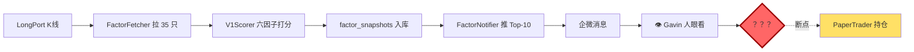

# 🔍 AI Quant 系统漏洞全景图

> [!info] 这份文档是什么
> 一次**只读诊断**的产出——不改代码、不做决定、不吹牛。
> 目标：让 Gavin 用 10 分钟看清系统最弱的地方、最值得修的地方，然后**自主**挑下一步方向。
>
> **每个漏洞都带代码证据**（文件路径/行号/SQL 查询结果），避免空谈。
> **每个决策点只给选项不给结论**。

---

## 📑 目录

1. [[#1. 执行摘要]]
2. [[#2. 能力矩阵]]
3. [[#3. 漏洞全景（P0/P1/P2）]]
4. [[#🎯 4. 专题：让 V1 真能指导持仓]]
5. [[#5. 优先级矩阵（Impact × Effort）]]
6. [[#6. 建议路线图（按时间预算）]]
7. [[#7. 附录：不该做的事]]

---

## 1. 执行摘要

### 系统当前健康度评分

| 层 | 评分 | 一句话 |
|---|------|-------|
| 策略层 | **B+** | 3 策略覆盖趋势/反转/动量，per_symbol 映射成熟，但缺组合维度 |
| 回测层 | **A-** | ATR/442/Wilder RSI/PerShareCommission，工程质量高 |
| 数据层 | **A** | LongPort + Westock + FMP 三源互补，SQLite 缓存完善 |
| 风控层 | **B+** | 单票/熔断/财报窗口齐全，**缺行业集中度限制** |
| 交易层 | **C+** | Paper 成熟稳定；**LiveTrader 195 行空壳**，未接 scheduler |
| 监控层 | **A-** | 对账/Dashboard/企微三通道，Cyberpunk UI 做得漂亮 |
| 因子层 | **B** | V0/V1 六因子 + Notifier 推送，**但没有 action 产出** |
| 测试层 | **D** | 3 文件 / 469 行 / 覆盖率约 **3%**，系统性风险 |

**平均健康度：B（中上）**

### 最弱的 3 个点（一句话版）

1. 🔴 **V1 只会"看"不会"做"**——每天推 Top-10 给你，但和 Paper Trading 持仓完全断开，花架子
2. 🔴 **测试覆盖 3%**——16000 行代码只有 469 行测试，任何改动都在裸奔
3. 🟡 **LiveTrader 离实盘只差一个配置**——195 行代码写完了但没人敢按，没 runbook 没开关

### 最不值得担心的 3 个点

- ✅ **数据源**：三源互补，Westock 覆盖 89%+
- ✅ **风控基础设施**：ATR 止损 / 442 分批 / 熔断全齐
- ✅ **可观测性**：Dashboard + 企微 + 对账三件套

---

## 2. 能力矩阵

| 层 | 文件 | 代码量 | 成熟度 | 已实现能力 | 薄弱点 |
|---|------|-------|-------|----------|--------|
| **策略** | `src/strategy/` 6 文件 | 712 行 | 高 | MA/RSI/Momentum + StrategyManager + per_symbol 映射 | 无多策略集成、无择时、无 sector rotation |
| **回测** | `src/backtest/` 5 文件 | 991 行 | 高 | BacktestEngine + ATR/442 止损 + PerShareCommission + Calmar/Sharpe | 无 Forward Backtest 框架、无业绩归因 |
| **数据** | `src/data/` 9 文件 | 2645 行 | 高 | LongPort 主源 + Westock 基本面 + FMP 备份 + SQLite 缓存 + USMarketCalendar + trading_state KV | FMP 覆盖率只 59%（但已降级）、无 A 股/港股扩展 |
| **风控** | `src/risk/` 4 文件 | 1004 行 | 中高 | PositionSizer + RiskManager + StopLossManager + PositionTracker + 熔断 + 财报窗口 | **无行业集中度限制**、无组合风险（Beta/VaR） |
| **交易** | `src/trader/` 5 文件 | 1131 行 | 中 | PaperTrader（完整）+ Scheduler（APScheduler 5 Job）+ OrderManager | **LiveTrader 195 行空壳**，未接 Scheduler，无 runbook |
| **监控** | `src/monitor/` 7 文件 | 1312 行 | 高 | AlertManager（3 通道）+ DailyReconciliation + Dashboard（Cyberpunk）+ WeComChannel | 无新闻/事件监控、Dashboard 无因子时序图 |
| **因子** | `src/factor/` 6 文件 | 1098 行 | 中高 | V0 4 因子 + V1 6 因子 + industry_map + FactorNotifier | **无 action 产出**（选股→持仓断链）、无 Forward Backtest |
| **测试** | `tests/` 3 文件 | 469 行 | **D（差）** | test_data / test_risk / test_strategies | 覆盖率约 3%，无 factor/trader/monitor 测试 |
| **脚本** | `scripts/` 20 文件 | 6943 行 | 高 | 因子打分/回测/Dashboard/下载/AB 对比/参数扫描 | 部分脚本缺 --help 和 dry-run |

**总规模**：约 16,000 行业务代码 + 10 篇 dev 文档 + 8 篇学习笔记

---

## 3. 漏洞全景（P0/P1/P2）

> [!tip] 如何阅读每个漏洞卡
> - **现象**：用户视角看到了什么
> - **证据**：代码路径:行号 / SQL 查询结果 / grep 命令
> - **影响**：不修会有什么后果
> - **修法思路**：大致方向（不展开实现细节）
> - **评分**：价值（1-5 ⭐）/ 耗时（小时）/ 风险（低中高）

---

### 🔴 P0-1：V1 选股 → 持仓的断链

> [!danger] V1 从未进入实际交易决策
> 每天跑完 V1 Top-10，推到企微，但 Paper Trading 完全不知道 V1 的存在。这是目前系统**最大的产品级漏洞**。

**现象**：
- V1 生成 `factor_screen_2026-04-25_v1.md`，有名单、有得分、有排名
- FactorNotifier 推送"今日 Top-5 + 排名变化"
- **但**：持仓 `MSFT/NVDA/META/TSM/AVGO` 和 V1 Top-10 只有 **TSM/NVDA** 重叠（2/5）
- 你看了报告——然后呢？没有然后。

**证据**：
```bash
# V1 产出没有任何 action 字段
grep -iE "建议|推荐持仓|action|调仓|买入|卖出" \
     output/factor_screen_2026-04-25_v1.md
# (空结果)

# FactorNotifier 源码
src/factor/factor_notifier.py:3
  "推送 Top-10 + 排名变化到企业微信"  # 只推状态，不推 action

# 持仓 vs V1 Top-10
持仓: MSFT / NVDA / META / TSM / AVGO
V1 Top-10: MU / TSM / INTC / MRVL / IWM / CAT / GOOGL / NVDA / KO / JNJ
重叠: {TSM, NVDA}  ← 只有 2 只
```

**影响**：
- V1 投入了 ~2400 行代码，但**价值交付 = 每天收到一条看看就划走的消息**
- 决策链里的"看 V1 → 决定换不换仓 → 下单"全靠 Gavin 人肉判断
- 所有 V1 的 alpha 潜力都沉睡

**修法思路**（具体方案见 [[#🎯 4. 专题：让 V1 真能指导持仓]]）：
- 保守：加"持仓偏离 V1 Top-10"告警
- 中等：每周跑"V1 Top-N 组合 vs 当前持仓"回测
- 激进：PaperTrader 按 V1 Top-N 自动调仓

**评分**：价值 ⭐⭐⭐⭐⭐ / 耗时 30min~2 天（看方案）/ 风险 低~高

---

### 🔴 P0-2：测试覆盖率 3%

> [!danger] 16000 行代码 vs 469 行测试
> 这不是"测试不够好"，是**基础设施级缺口**。每次改风控或因子都靠手动验证，回归风险随代码量指数增长。

**现象**：
- 改完代码跑一遍 daily-scan，没崩就算通过
- 每次加功能都担心"会不会打破原有逻辑"
- 重构念头一起就劝退（没测试兜底）

**证据**：
```bash
# 测试文件清单
tests/test_data.py        # 只测数据层
tests/test_risk.py        # 部分风控
tests/test_strategies.py  # 部分策略
# 合计 469 行

# 业务代码
src/**/*.py + scripts/**/*.py ≈ 16,000 行

# 覆盖的模块
覆盖：data, risk（部分）, strategies（部分）
缺失：factor/trader/monitor/backtest 全部，scripts 全部
```

**影响**：
- 改动 → 不敢重构 → 代码逐渐发霉 → 更不敢动 → 恶性循环
- 阶段 8 Fix 里 8 个 bug 本来可以用单测防住
- 未来接实盘时**没有测试安全网**是致命的

**修法思路**：
- 从 P0 关键模块开始：`FactorScorer` / `V1Scorer` / `PositionSizer` / `StopLossManager`
- 目标覆盖率：关键路径 80%+（不追求整体 80%）
- 用 pytest + fixtures，先写 happy path 再补边界
- 2-3 小时集中补 50% 关键模块的骨架

**评分**：价值 ⭐⭐⭐⭐ / 耗时 2-4 小时（关键模块）/ 风险 极低

---

### 🔴 P0-3：LiveTrader 空壳

> [!warning] 代码齐了，能力没齐
> 195 行 LiveTrader 写好了 5 个核心方法，但没人敢按 `confirm_live_trading()` 那个开关。

**现象**：
- `src/trader/live_trader.py` 存在、可 import、方法齐全
- 但**从未**在 scheduler / run_paper_trade / 任何脚本里出现过
- 没有"怎么从 Paper 切到 Live"的文档
- 没有"实盘挂了怎么紧急停机"的 runbook

**证据**：
```python
# src/trader/live_trader.py  共 195 行
class LiveTrader:
    def __init__(...)              # L31
    def confirm_live_trading(...)  # L51  <- 危险开关，无人调用
    def execute_signal(...)        # L59
    def cancel_order(...)          # L163
    def sync_positions(...)        # L173
    def update_atr(...)            # L189

# 搜索整个仓库
$ grep -rn "LiveTrader\|live_trader" src/ scripts/
# 只有 trader/__init__.py 的 import，无调用点
```

**影响**：
- **不是"不能实盘"**，而是"**没人敢**实盘"——没有操作手册
- 未来想切实盘时会发现"我到底怎么切？"
- 风控参数到底在实盘下表现如何，没有验证路径

**修法思路**（不等于现在切实盘）：
- 第一步：写 runbook（从 Paper 切到 Live 的 checklist）
- 第二步：给 LiveTrader 加状态持久化（dump/load_state 对齐 PaperTrader）
- 第三步：在 Scheduler 加 `--mode live` flag（带 5 重确认）
- **第四步（远期）**：小金额实盘测试（≤$1000 / 单策略 / 1 周）

**评分**：价值 ⭐⭐⭐⭐（远期决定实盘）/ 耗时 1-2h（runbook）+ 1 天（实盘接入）/ 风险 低（runbook 阶段）→ 高（实盘阶段）

---

### 🔴 P0-4：实盘样本不足（4 天）

> [!warning] 所有统计结论都是"指示性"的
> Sharpe 4.20 / Calmar XX / 胜率 62% 这些数字不能相信——样本只有 4 天。

**现象**：
- Paper Trading 从 2026-04-22 跑到 04-25，共 4 个交易日
- 11 次成交
- 所有回测指标都是"看起来很美"但置信度低

**证据**：
```sql
SELECT MIN(date), MAX(date), COUNT(*) FROM daily_performance;
-- 2026-04-22 | 2026-04-25 | 4

SELECT COUNT(*) FROM trade_records;
-- 11
```

**影响**：
- 4 天不够看策略真正表现（需要至少 1 个月覆盖市场波动）
- Sharpe 4.20 很可能是"刚好赶上小牛市"，不是真 alpha
- 任何"按数据优化参数"的决策都危险

**修法思路**：
- **什么都不做，等时间**——这是唯一解
- 继续 launchd 每天自动跑，积累到 1 个月（20 交易日）再看数据
- 中间改动不要基于这 4 天数据下决定

**评分**：价值 ⭐⭐（时间的价值）/ 耗时 0（等待）/ 风险 0

> [!note] 这不是 bug，是"时间不够"
> 不在本次可修漏洞清单内，但**必须知道**：**现在做任何"基于回测数据"的决策都不靠谱**。

---

### 🟡 P1-1：无组合优化 / 等权持仓

> [!tip] 当前持仓逻辑：全部等权
> V1 Top-N 如果要买，每只 10%，不管行业重合/相关性/波动率。

**现象**：
- 当前 5 持仓各占 ~20%（现金 50%）
- 如果明天按 V1 Top-5 换仓：MU 20% + TSM 20% + INTC 20% + MRVL 20% + IWM 20% → **半导体仓位 80%**
- 任何半导体一次大跌（如 2026 美光财报爆雷）直接让账户腰斩

**证据**：
```bash
# grep 组合优化关键词
$ grep -rln "mean_variance\|kelly\|risk_parity\|portfolio_optim" src/
# (空)

# 没有 portfolio 模块
$ ls src/portfolio/
# (不存在)

# PositionSizer 只做单标的 risk-based ATR
src/risk/position_sizer.py  # 关注"买多少股"，不关注"多只怎么组合"
```

**影响**：
- V1 Top-5 全是半导体 → 等权买 = 半导体 100% 曝光
- 没有"各标的相关性加权"，不同步的波动会叠加
- 没有 Kelly Criterion → 不知道"该用多大仓位"

**修法思路**：
- 第一步（最简）：行业集中度硬约束（下一条 P1-2）
- 第二步：等波动权重（vol-parity）—— 按 ATR 反比权重，高波动标的少配
- 第三步：Markowitz 均值方差优化（需要协方差矩阵，数据要求高）
- 远期：Risk Parity / Black-Litterman（过度工程化了，不推荐）

**评分**：价值 ⭐⭐⭐⭐ / 耗时 2-4h（vol-parity）/ 风险 低

---

### 🟡 P1-2：无行业集中度限制

> [!warning] V1 设计偏爱半导体 + 风控对行业无感 = 潜在黑天鹅
> V1 Top-5 全是半导体和 ETF，但 RiskManager 只看"单票 ≤45%"，不看"行业合计"。

**现象**：
- V1 Industry 因子加权给半导体 +1.0σ（最高档）
- V1 Top-5 实测：MU / TSM / INTC / MRVL / IWM（**4 只半导体 + 1 只 ETF**）
- RiskManager 检查：单票 ≤ 45% ✓ → 全通过 → 但**半导体 80%**

**证据**：
```python
# src/risk/risk_manager.py 现有约束
max_position_pct = 0.45  # 单票 ≤ 45%
max_daily_loss = 0.03    # 日亏损 ≤ 3%
circuit_breaker = 0.20   # 累计回撤 ≤ 20%
# 没有：max_sector_concentration 这种字段

# Watchlist 行业分布（真实 SQL 结果）
SELECT industry, COUNT(*) FROM factor_snapshots
WHERE version='v1' AND date='2026-04-25' GROUP BY industry;
-- 半导体        8  ← 占 23%
-- 信托/基金      3
-- 封装式软件     2
-- 大型银行      2
-- ... （其他都 ≤ 2）
```

**影响**：
- 2026 年美光财报雷 / 台积电地缘事件 → 半导体整体大跌 15% → 账户腰斩 12%+
- V1 体系的"AI 偏好"设计导致行业风险被主动放大

**修法思路**：
- 加 `max_sector_concentration = 0.40`（单行业 ≤ 40%）
- 加 `max_industry_concentration = 0.25`（单细分行业 ≤ 25%）
- V1 推仓位建议时先做行业去重（Top-5 如果全半导体 → 保留 Top-2，补下一个行业 Top）

**评分**：价值 ⭐⭐⭐⭐⭐ / 耗时 1-2h / 风险 低

---

### 🟡 P1-3：无择时 / 大盘状态感知

**现象**：
- 系统 100% Bottom-up：选出 Top-5 就买
- 大盘涨到高位、VIX 飙升、宏观风险出现时，**完全无感**
- 只有单股 ATR 止损兜底

**证据**：
```bash
$ grep -rn "vix\|market_regime\|dxy\|yield_curve\|macro" src/
# (空)
```

**影响**：
- 2022 那种全年单边熊市，系统会全程持仓硬扛
- 无法区分"震荡市适合动量"vs"趋势市适合价值"

**修法思路**（**从简单到复杂**）：
- **最简**：SPY 跌破 200MA → 仓位减半（机械择时）
- **中等**：VIX 分位（>80 分位减仓，<20 分位满仓）
- **复杂**：大盘 regime 分类（需要 ML）→ 过度工程化，不推荐

**评分**：价值 ⭐⭐⭐ / 耗时 2-3h（最简版）/ 风险 中（择时本身有 alpha 损耗）

---

### 🟡 P1-4：无业绩归因

**现象**：
- 月末看到"累计收益 +8%"
- **但**：哪个策略贡献最多？哪只股票是功臣？哪个因子在起作用？**不知道**
- 只能事后靠日志拼凑

**证据**：
```bash
$ ls scripts/ | grep -i attrib
# (空)

# PerformanceReporter 只输出总览
src/monitor/performance_reporter.py  # 含: 总收益/最大回撤/Sharpe，无分解
```

**影响**：
- 无法回答"下周要不要砍掉 RSI 策略"（因为不知道它贡献多少）
- 无法验证 V1 因子权重是否合理（因为不知道 Industry vs Momentum 哪个起作用）
- 参数调优只能瞎调

**修法思路**：
- 交易级归因：每笔 trade 打 `strategy_source / signal_reason` 标签
- 策略级归因：按 strategy_id 聚合 PnL
- 因子级归因：对每次买入记录当时的因子得分，事后算因子-收益相关性

**评分**：价值 ⭐⭐⭐⭐ / 耗时 3-4h / 风险 低

---

### 🟡 P1-5：无 Forward Backtest 框架

**现象**：
- V1 每天积累 snapshot 到 `factor_snapshots` 表
- 但没有脚本能"自动扫 60 天历史 snapshot，算每次 Top-10 未来 N 天收益，汇总出真实 alpha"

**证据**：
```bash
$ ls scripts/ | grep -i forward
# (空)

$ sqlite3 data_cache/quant.db "SELECT DISTINCT date FROM factor_snapshots WHERE version='v1'"
# 目前只 1 天：2026-04-25
```

**影响**：
- 3 个月后有 60 份快照时，没有工具能用
- Forward Backtest 是验证因子真实有效性的**唯一科学方法**
- 现在不建框架，3 个月后还是空手

**修法思路**：
- 新建 `scripts/forward_backtest_factor.py`
- 遍历 DB 里所有 V1 snapshot 日期
- 每个日期取 Top-N → 计算 N+1 到 N+30 日组合收益
- 汇总：平均 Alpha / Sharpe / 胜率（每个 snapshot 算一次）
- 输出 Markdown 报告

**评分**：价值 ⭐⭐⭐⭐（3 个月后才兑现）/ 耗时 2-3h / 风险 低

> [!note] 建议现在就建框架
> 代码写好了先空跑。等 snapshot 够了直接出结果。

---

### 🟢 P2-1：Momentum 策略数据不足时假信号

**现象**：
- 新上 Watchlist 的标的（比如刚加的 PLTR/SMCI）K 线历史不足 20 天
- Momentum 策略的 acceleration 计算得 0 → 可能触发"看多"误信号

**证据**：
```python
# src/strategy/momentum_strategy.py
if len(df) < lookback + 1:
    acceleration = 0  # <- 数据不足时默认 0，可能被当作"正加速"
```

**影响**：
- 新标的上架首周可能有一次虚假买入
- 影响面：仅新增标的，已 MEMORY 记录

**修法思路**：
- 数据不足时返回 `None` 而不是 0，上游判空跳过

**评分**：价值 ⭐⭐ / 耗时 15min / 风险 低

---

### 🟢 P2-2：Signal Overlap = False 的多策略冲突

**现象**：
- 配置里 `overlap = false`
- 多策略看好同一标的时，只执行最高 confidence 的那个
- 其他策略的信号被无声丢弃

**证据**：
```yaml
# config/strategies.yaml
signal:
  overlap: false  # <- MEMORY 已记录，当前行为
```

**影响**：
- 如果 MA_Cross + Momentum 都看好 NVDA（强信号叠加），只触发一次
- 降低了"强共识"信号的仓位权重

**修法思路**：
- 改 `overlap = true` + 仓位调整逻辑（共识信号放大 1.5 倍）

**评分**：价值 ⭐⭐ / 耗时 30min / 风险 中（改动影响交易频次）

---

### 🟢 P2-3：Dashboard 无因子时序图

**现象**：
- Dashboard 目前只显示"今日 V1 Top-5"
- 没有"过去 30 天 V1 Top-10 每日变化热图"
- 看不出因子权重有没有周期性偏移

**修法思路**：
- ApexCharts 加一个 heatmap（x=日期，y=Top-10 symbol，颜色=rank）
- 数据源：`factor_snapshots` 表

**评分**：价值 ⭐⭐ / 耗时 2-3h / 风险 低

---

### 🟢 P2-4：无新闻事件监控

**现象**：
- 财报日只有"提前 1 天禁止开仓"
- FOMC / CPI / 公司公告等事件**完全无感**

**修法思路**：
- 集成 `westock-data calendar` 拉投资日历
- 关键事件前后自动减仓/加告警

**评分**：价值 ⭐⭐⭐ / 耗时 4-6h / 风险 中

---

### 🟢 P2-5：无 A 股/港股扩展

**现象**：
- 代码里美股硬编码（比如 `.US` 后缀、USMarketCalendar、美东时区）
- LongPort 支持港股/A 股，但系统不支持

**修法思路**：
- 抽象 MarketCalendar 基类，USMarketCalendar + HKMarketCalendar
- Symbol 层加 market 字段
- **但**：牵涉面广，不推荐做

**评分**：价值 ⭐⭐（未必真需要）/ 耗时 2-3 天 / 风险 高（大重构）

---

## 🎯 4. 专题：让 V1 真能指导持仓

> [!info] 这是文档最深的一章
> 因为 Gavin 明确说"mindset = 让 V1 真能指导持仓（可执行的 action）"。
> 下面给 3 种方案，客观对比，不做推荐。

### 4.1 当前断点诊断



**断点位置**：**H 到 I 之间**（从"看到报告"到"改变持仓"）。

**当前状态**：人肉决策，无任何自动化。

---

### 4.2 三种方案对比

| 维度 | 🟢 保守<br>**持仓差异提示** | 🟡 中等<br>**模拟换仓回测** | 🔴 激进<br>**自动换仓** |
|------|----------------------|----------------------|------------------|
| **核心产出** | 每日企微告警：「持仓和 V1 Top-10 重叠度 X%」 | 每周 Markdown 报告：「按 V1 Top-5 换仓 vs 当前持仓 30 天 PnL」 | PaperTrader 按 V1 Top-N 自动调仓 |
| **决策权** | 完全在 Gavin（看告警自己决定）| 完全在 Gavin（看报告自己决定）| 系统自动（Gavin 只做风控审核）|
| **前置条件** | 无 | 需扩 `backtest_factor_screen.py` 支持"组合 vs 当前持仓"双组对比 | 需先做：<br>① 组合优化（P1-1）<br>② 行业集中度限制（P1-2）<br>③ 交易成本模型完善<br>④ 实盘样本 1 个月+ |
| **实施耗时** | 30 min | 2-3 小时 | 1-2 天 |
| **实施风险** | 零（只读推送）| 低（只产报告）| **高**（真动持仓，样本不足时可能亏钱）|
| **适合时机** | 现在立刻 | V1 积累 2 周 snapshot 后 | V1 积累 3 个月 + Forward Backtest 有正 Alpha 后 |
| **产出样例** | `持仓偏离: 3/5 只不在 V1 Top-10 (MSFT/META/AVGO), 建议关注` | `[2026-05-04 周报] 当前持仓 30d +3.2% vs V1 Top-5 +5.8%, V1 超额 +2.6%` | `[2026-05-05] 卖 MSFT (V1 rank #18) 买 MU (V1 rank #1), size 20%` |
| **可退出** | ✓ 随时关告警 | ✓ 随时不看报告 | ✗ 改动了持仓，回不去 |

---

### 4.3 每方案的前置条件详解

#### 🟢 保守「持仓差异提示」

**前置**：无（当前一切就绪）

**新增代码**（估计）：
- 给 `FactorNotifier` 加 `notify_position_gap()` 方法
- 读 `trading_state.paper.positions` + 最新 V1 Top-10
- 算重叠度 + 偏离项
- 走现有 WeCom 通道推送

**风险**：零

---

#### 🟡 中等「模拟换仓回测」

**前置条件**：
1. `backtest_factor_screen.py` 需要扩展支持"双组对比"
2. 当前持仓数据要能正确喂给回测（已有 `trading_state`）
3. 基准选择（QQQ？当前持仓？）需先想好

**新增代码**（估计）：
- 新建 `scripts/weekly_rotation_report.py`
- 每周日/周一触发
- 跑两组回测：(a) 当前持仓等权 (b) V1 Top-5 等权
- 对比累计收益 / Sharpe / 回撤 / Beta

**风险**：低（只产报告不动持仓）

---

#### 🔴 激进「自动换仓」

**前置条件**（硬门槛，不满足不能上）：
1. **组合优化就位**（P1-1 做完）：不能等权买 5 只半导体
2. **行业集中度限制就位**（P1-2 做完）：半导体 ≤ 40%
3. **交易成本模型完善**：换仓频率高时成本会吃掉 alpha
4. **V1 Forward Backtest 验证**（P1-5 做完 + 3 个月积累）：有真实正 Alpha 证据
5. **Paper Trading 样本 ≥ 1 个月**（P0-4 时间等）：有业绩参考
6. **有明确退出机制**：V1 连续 N 周跑输 QQQ → 暂停自动换仓

**新增代码**（估计大）：
- 新建 `src/portfolio/rebalancer.py`（调仓引擎）
- 扩展 `PaperTradingScheduler` 支持 weekly rotation job
- V1 Top-N → 目标持仓 → diff → 生成买卖 Order 列表
- 对接现有 PositionSizer + RiskManager + OrderManager

**风险**：高（真动钱，样本不足时可能亏）

---

### 4.4 最小闭环推荐（客观描述，不推荐）

如果要**立刻有东西可用**（今晚/明天能看到产出），**保守方案 🟢 是唯一选项**——其他都需要前置工作。

保守方案的最小闭环：

1. ✍️ 新建 `FactorNotifier.notify_position_gap()` 方法（~30 行）
2. 🔧 在 daily-scan 流程里加 hook：V1 跑完后额外调一次 `notify_position_gap()`
3. 📣 企微收到第二条消息：「当前持仓和 V1 Top-10 差异分析」
4. 👁️ Gavin 人肉决定要不要换仓

**这不能代替中等/激进方案**，但是**无前置、无风险、立刻见效**。

> [!tip] Gavin 自己决定
> 上面是 3 个选项的客观描述，**不推荐**任何一个。
> 你可以：
> - 只做保守（最稳）
> - 保守 + 中等并行（保守 now，中等 2 周后）
> - 直接跳到激进（但必须先做 P1-1/P1-2/P1-5 + 等 3 个月）
> - 什么都不做，继续只看不动

---

## 5. 优先级矩阵（Impact × Effort）

```
                           Impact 高
                               ↑
                               |
   ★ 立刻做（四象限之首）      |    ◆ 规划专项（值得但重）
   ───────────────────         |    ─────────────────
   P0-1 V1 持仓差异提示(保守)   |    P1-1 组合优化
   P1-2 行业集中度限制          |    P0-3 LiveTrader runbook + 实盘接入
   P2-2 Signal overlap 修正     |    P0-2 测试覆盖提到 50%
                               |    P1-4 业绩归因
                               |    P1-5 Forward Backtest 框架
                               |    P1-3 大盘择时
                               |
   Effort 低 ────────────────── ┼ ────────────────── Effort 高
                               |
   ◇ 顺手做（锦上添花）         |    ✗ 不做（或远期）
   ─────────────────            |    ─────────────
   P0-2 关键路径单测(仅风控/因子) |    P2-5 A 股/港股扩展
   P2-1 Momentum 假信号修       |    P2-4 新闻事件监控
   P2-3 Dashboard 因子时序图     |    （多账户、ML 择时）
                               |
                               ↓
                           Impact 低
```

### 四象限解读

| 象限 | 特点 | 本清单内容 | 建议 |
|------|------|-----------|------|
| **★ 立刻做** | 高价值 + 低耗时 | V1 持仓提示 / 行业限制 / Signal 修正 | **优先**，当晚/周末就能收尾 |
| **◆ 规划专项** | 高价值 + 高耗时 | 组合优化 / LiveTrader / 测试 / 归因 / Forward / 择时 | 按周安排，一个月做 1-2 个 |
| **◇ 顺手做** | 低价值 + 低耗时 | 关键单测骨架 / Momentum 修 / Dashboard 热图 | 心情好做 |
| **✗ 不做** | 低价值 + 高耗时 | A 股扩展 / 新闻监控 | 除非业务真需要，否则不碰 |

---

## 6. 建议路线图（按时间预算）

### ⏱ 只有 2 小时（某个深夜）

**目标**：快速补足最致命的 2 个漏洞，零风险。

1. **[60min] P0-1 保守版**：FactorNotifier 加 `notify_position_gap()` + daily-scan 接入
   - 产出：企微每天多推一条"持仓 vs V1 Top-10 差异"
2. **[45min] P1-2 行业集中度限制**：RiskManager 加 `max_sector_concentration=0.40`
   - 产出：未来 V1 建议 Top-5 里 4 只半导体时，自动过滤
3. **[15min] commit + 文档更新**

### 🌙 有一晚（3-4 小时）

**目标**：在"2 小时方案"基础上加测试和归因基础。

- 上述全部 (2h)
- **[1-1.5h] P0-2 关键路径单测**：V1Scorer / PositionSizer / StopLossManager 各写 10-15 个 test case
  - 不追求覆盖率，覆盖"核心 happy path + 2-3 个边界"
- **[30min] P2-2 Signal overlap=true 切换**：提高强共识信号仓位
- **[30min] 补 daily 文档**

### 📆 有一周（分 3 个晚上）

**Day 1（深耕 V1 可执行）**：
- P0-1 保守版 + 中等版（模拟换仓回测脚本）
- P1-2 行业集中度限制

**Day 2（可靠性）**：
- P0-2 关键路径单测（V1/PositionSizer/StopLoss）
- P0-3 LiveTrader runbook（纯文档）
- P1-4 业绩归因（trade 加 strategy_source 标签）

**Day 3（未来收益）**：
- P1-5 Forward Backtest 框架（代码先建空跑）
- P2-3 Dashboard 因子时序 heatmap
- 所有代码推 GitHub + 文档补 dev-11

**Day 1+2 结束时系统质量**：B+ → A-
**Day 3 结束时**：解锁未来 3 个月的复利

---

## 7. 附录：不该做的事

> [!warning] 以下建议**不做**
> 不是因为没价值，而是**当前阶段做它们的边际收益低 / 风险高 / 性价比差**。

### ❌ A 股 / 港股扩展（P2-5）

- **理由**：代码重构量 2-3 天，LongPort 能覆盖但系统里到处硬编码美股
- **除非**：Gavin 实盘账户要做多市场对冲
- **现在的 trade-off**：美股单市场已经够复杂，先做深不做广

### ❌ ML 驱动的择时 / 因子

- **理由**：4 天样本训练 ML 必过拟合；你已经有清晰的"因子 + 权重"框架，ML 是黑盒化
- **除非**：3 年后数据积累够 + 有人专门搞 research
- **当下替代**：简单的 SPY-200MA 择时已经覆盖 80% 场景

### ❌ 复杂的组合优化（Black-Litterman / Risk Parity）

- **理由**：只有 5 持仓，Markowitz 都是杀鸡用牛刀
- **除非**：持仓数 ≥ 20 + 有多市场 + 研究 1 个月+
- **当下替代**：vol-parity（按 ATR 反比权重）已经能解决 90% 问题

### ❌ 实盘（除非 6 条前置全满足）

- **理由**：看 P0-3 / P1-1 / P1-2 / P1-5 / P0-4 / LiveTrader runbook——**6 个硬门槛**
- **除非**：全部 satisfy 且 Paper 跑赢 QQQ 至少 3 个月
- **当下替代**：Paper 继续积累，等数据说话

### ❌ 多账户 / 主备 / 高可用

- **理由**：个人量化不是金融机构，一台 Mac 挂 launchd 已经够用
- **除非**：账户金额 ≥ 千万级
- **当下**：保持最简架构

### ❌ 自建 Web 界面

- **理由**：Dashboard HTML 已经够用，企微推送已经及时
- **除非**：Gavin 要给别人展示
- **当下**：一个 HTML + 一个企微足矣

### ❌ 重构（无明确目的）

- **理由**：代码质量目前 B+，不差；重构若无新需求驱动，纯折腾
- **除非**：测试覆盖到 50% 后 + 业务需求变化
- **当下**：**先补测试，再说重构**

---

## 🔗 关联文档

- [[dev-00-系统概览]] - 系统架构基础
- [[dev-04-回测记录]] - 96 次 A/B 回测历史（V1 Alpha 来源）
- [[dev-05-风控规则]] - 当前风控参数清单（行业限制需新增）
- [[dev-08-监控与运维]] - AlertManager / Dashboard / launchd
- [[dev-09-多因子选股规划]] - V0/V1 完整设计 + 生产化集成

---

> [!tip] 文档使用方式
> 1. 花 3 分钟读「执行摘要」和「能力矩阵」——建立全貌
> 2. 按你关心的优先级（P0/P1/P2）读对应漏洞卡
> 3. V1 可执行性是你的 mindset focus，**专题章值得逐字读**
> 4. 看完矩阵和路线图，**你自己挑 2 个**要做的
> 5. 挑完后告诉我，我再出具体的执行 plan

**你选完方向后，我不做任何预设——重新出执行 plan、由你确认后开干。**
