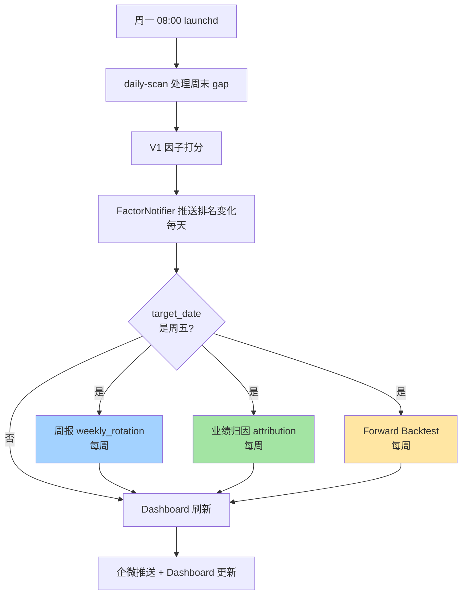

# dev-12 · P1 修复全集（阶段 11）

> 关联：[[dev-09-多因子选股规划]] · [[dev-10-系统漏洞全景图]] · [[dev-11-V1可执行集成与测试补强]]
> 时间：2026-04-27 → 2026-04-28（3 晚通宵）
> 战绩：**7 项 P1 全修复 + 测试 116 → 167 / 0 fail**
> 状态：✅ 已完成

---

## 🎯 战绩总览

> [!success] **3 晚搞定 7 项 P1**
>
> - 第一晚（4 项）：P1-7 SELL 放行 / P1-6 测试澄清 / P1-2 行业限制 / P1-1 vol-parity
> - 第二晚（2 项）：P1-3 SPY-200MA 大盘择时 / P1-4 业绩归因
> - 第三晚（1 项 + 文档）：P1-5 Forward Backtest 框架 / dev-12 综合文档

| 指标 | 修复前 | 修复后 | 增量 |
|------|-------|-------|------|
| 测试数 | 116 | **167** | +51 |
| 测试通过率 | 100% | **100%** | 维持 |
| Git commits | - | **5** | s11 系列 |
| 新增模块 | - | **3** | regime_detector / attribution / forward_backtest |
| 新增 config 段 | - | **3** | sector_concentration / industry_concentration / timing |
| Dashboard 卡片 | 9 个 | **10 个** | + Market Regime |
| 自动化触发 | V1 周报 | **+ 业绩归因 + Forward Backtest** | ×3 |

---

## 📋 7 项 P1 修复明细

### 🟢 第一晚 · 快赢 + 风控加固

#### P1-7：RiskManager 熔断后 SELL 放行

> [!bug] 真业务漏洞
> 触发熔断时所有信号被拒，包括 SELL（清仓/止损），导致风险被人为放大。

**修法**：
```python
# src/risk/risk_manager.py L94
# 把 SELL 放行块挪到熔断检查前
if signal.signal != Signal.BUY:
    return RiskCheckResult(passed=True, ...)  # SELL 永远放行

# 熔断检查仅拦截 BUY
if self._is_circuit_breaker:
    return RiskCheckResult(passed=False, ...)
```

**影响**：触发熔断时仍可清仓/止损，风险可控。

---

#### P1-6：PositionSizer existing 测试澄清

> [!info] 误判修正
> dev-11 标记的 `[TODO]` 实为误判——`_calc_fixed_pct` 已正确扣减 `existing_position_value`。

**真相**：
- `default_pct = 10%` 是建议仓位
- `max_pct = 20%` 是单票绝对上限
- 当 existing 占用一部分时，新建仓 = `min(default_pct × total, max_pct × total - existing)`

**修法**：删除 `[TODO]` 测试，改为 3 个明确语义测试 case：
- `default<remaining` 时取 default
- existing 已超 max 时返回 0
- `remaining<default` 时取 max 限制

---

#### P1-2：行业集中度限制 ⭐ 默认开启

> [!warning] 现实风险
> V1 Top-5 全是半导体（MU/TSM/INTC/MRVL），等权买入时半导体集中度 40%+，无任何约束。

**修法**：

config/risk.yaml：
```yaml
portfolio_limits:
  max_sector_concentration: 0.40       # 单 sector ≤ 40%
  max_industry_concentration: 0.25     # 单 industry ≤ 25%
```

src/risk/risk_manager.py（check_order 4b 段）：
```python
sec, ind = self._lookup_sector_industry(signal.symbol)  # 查 fundamental_ratios
sec_after, ind_after = self._compute_sector_exposure(...)
if sec_after > max_sector_pct:
    reasons.append(f"Sector concentration: '{sec}' would be {sec_after:.1%}...")
```

**测试**（6 case）：
- 第一只半导体应通过
- 半导体已 20%，再加 10% 超 25% → 拒
- 电子技术已 35%，再加 10% 超 40% → 拒
- 不同 sector（医药）应通过
- unknown symbol 应跳过该限制
- config 设 0 时禁用

**影响**：下次 V1 推 4 只半导体时，第 2-3 只买入会被自动拒。**周报会显示更多"V1 推荐但未持有"——符合预期**。

---

#### P1-1：vol-parity 组合优化模式 ⏸ 默认关闭（可选 mode）

> [!note] 设计选择
> 为避免一夜之间改变所有买入决策，vol-parity 仅作为可选 mode，默认 mode 仍是 `risk_based_atr`。

**公式**：
```
actual_vol_pct = ATR / price       # 标的的"日波动百分比"
target_vol_pct = config (默认 3%)
multiplier = target_vol_pct / actual_vol_pct
adjusted_pct = default_pct × multiplier   # [0.5×default, max_single_pct] 边界保护
```

**语义**：
- 高波动标的（ATR/price 大）→ 仓位变小
- 低波动标的 → 仓位变大
- 让组合各标的的"风险贡献"接近一致

**测试**（6 case）：
- 高波动 → 小仓位
- 低波动 → 大仓位（受 max 限制）
- 中性波动等于 default
- 无 ATR 退化 fixed_pct
- existing 配额扣减
- 超高波动下限保护

**启用方式**：
```yaml
position:
  mode: vol_parity           # 改为 vol_parity
  vol_parity:
    target_vol_pct: 0.03     # 目标日波动 3%
```

---

### 🟡 第二晚 · 能力扩展 1

#### P1-3：SPY-200MA 大盘择时（RegimeDetector）⏸ 默认关闭

**新模块**：`src/strategy/regime_detector.py`（225 行）

**核心**：
- `RegimeDetector.detect()`：从 SQLite 读 SPY K 线 + 算 200MA → 判 BULL/BEAR/NEUTRAL
- `RegimeStatus` dataclass：含 `regime / spy_close / spy_ma / deviation_pct / as_of_date`
- `get_position_multiplier(status)`：bear → 0.5（默认），bull/neutral → 1.0

**接入 RiskManager**（check_order 4c 段）：
```python
regime_multiplier = self._get_regime_multiplier(today)
if regime_multiplier < 1.0:
    target_amount = target_amount * regime_multiplier
    # bear 时仓位 ×0.5
```

**Dashboard 新增 Market Regime 卡片**（[Cyberpunk 风]）：
```
🌡 MARKET REGIME [BULL · ⏸]
🐂 BULL    SPY $706.71 vs 200MA $664.11 (+6.41%)
📅 数据截至 2026-04-21 · 配置状态 ⏸ 待启用
```

**测试**（14 case）：mock SPY K 线测三种 regime / 数据不足容错 / disabled 路径

**实测**：当前 SPY = **BULL +6.41%**（706.71 vs 200MA 664.11）

**启用方式**：
```yaml
timing:
  enabled: true                    # 默认 false
  bear_position_multiplier: 0.5
```

---

#### P1-4：业绩归因（attribution_report.py）

**新脚本**：`scripts/attribution_report.py`（345 行）

**核心算法**：
- `compute_realized_pnl_by_symbol`：FIFO 配对算已实现 PnL
- `compute_unrealized_pnl`：从 `paper.positions` 读浮盈
- `aggregate_by_strategy`：按 strategy 聚合（已实现 + 浮动 + 胜率 + 涉及标的）

**输出报告章节**：
1. 整体战绩（已实现 / 浮动 / 总计）
2. 按策略归因（哪个策略赚最多 / 亏最多）
3. Top-10 标的（最赚 / 最亏）
4. 持仓明细（当前每只浮盈）

**集成 daily-scan**：周五数据触发时同时跑（同 V1 周报节奏，每周 1 次）

**测试**（11 case）：FIFO 配对 / 多次 sell / 部分卖出 / by_strategy 归到买入策略 / 边界

**实测**：当前 4 天 11 笔交易 = **总 -$886**（已实现 -$488 + 浮动 -$398，momentum 策略全亏）

---

### 🔵 第三晚 · 能力扩展 2

#### P1-5：Forward Backtest 框架

**新脚本**：`scripts/forward_backtest_factor.py`（约 380 行）

**核心**：遍历所有 V1 snapshot 日期，每个日期取 Top-N 算 N+1~N+30 天等权组合收益，汇总平均 Alpha / Sharpe / 胜率 / IC（Spearman 信息系数）。

**IC 解读 4 档**：
| IC 区间 | 解读 | callout |
|---|---|---|
| ≥ 0.05 | 因子信号有效 | [!success] |
| 0.02 ~ 0.05 | 微弱信号 | [!info] |
| -0.02 ~ 0.02 | 无明显信号 | [!warning] |
| < -0.02 | 方向反了 | [!error] |

**样本警告**：< 30 个 snapshot 时报告头部加 [!warning] "样本仅 N 个，统计意义不足"

**测试**（12 case）：聚合 / 渲染 / IC 解读 / 单 snapshot mock

**实测**：当前 V1 仅 2 snapshot 且 K 线截止 04-21（无 forward 数据）→ 报告渲染 [!error]。**框架已建好，等数据积累自动有效**。

**集成 daily-scan**：周五数据触发，300s timeout（多 snapshot × 多 K 线）

---

## 🎁 测试发现的 2 个真业务漏洞

### 漏洞 1：PositionSizer existing 配额逻辑（dev-11 [TODO]）

**真相**：误判，已澄清并补 3 个测试 case 明确 default vs max 关系。

### 漏洞 2：RiskManager 熔断后 SELL 被拒

**真问题**，已修（P1-7）。熔断仅拦 BUY，SELL 永远放行。

---

## 📦 新增 / 修改文件清单

| 类型 | 文件 | 说明 |
|---|---|---|
| NEW | `src/strategy/regime_detector.py` | P1-3 RegimeDetector 主模块 |
| NEW | `scripts/attribution_report.py` | P1-4 业绩归因 |
| NEW | `scripts/forward_backtest_factor.py` | P1-5 Forward Backtest 框架 |
| NEW | `tests/test_regime_detector.py` | P1-3 测试（14 case） |
| NEW | `tests/test_attribution.py` | P1-4 测试（11 case） |
| NEW | `tests/test_forward_backtest.py` | P1-5 测试（12 case） |
| MOD | `config/risk.yaml` | + sector/industry concentration + timing 段 |
| MOD | `src/risk/risk_manager.py` | P1-7 SELL 放行 + P1-2 sector check + P1-3 regime check |
| MOD | `src/risk/position_sizer.py` | P1-1 加 vol_parity mode |
| MOD | `tests/test_risk_manager.py` | P1-7 改回 assertTrue + P1-2 加 6 case |
| MOD | `tests/test_position_sizer.py` | P1-6 重写 + P1-1 加 6 case |
| MOD | `scripts/build_dashboard.py` | + Market Regime 卡片 |
| MOD | `scripts/run_paper_trade.py` | daily-scan 加 attribution + forward_backtest hook |

---

## 🔄 自动化链路（每周）



---

## 🛡 默认开关状态

| 功能 | 默认 | 启用方式 |
|---|---|---|
| P1-7 SELL 放行 | ✅ 启用（无开关） | - |
| P1-6 测试澄清 | - | - |
| P1-2 行业限制 | ✅ 启用（保护性）| 改 `max_sector_concentration: 0` 禁用 |
| P1-1 vol-parity | ⏸ 关闭 | `position.mode: vol_parity` |
| P1-3 大盘择时 | ⏸ 关闭 | `timing.enabled: true` |
| P1-4 业绩归因 | ✅ 周一自动 | - |
| P1-5 Forward Backtest | ✅ 周一自动 | - |

**设计原则**：风控类（行业限制）默认开启，模式类（vol-parity / 择时）默认关闭，分析类（归因 / forward）默认开启但只读。

---

## 🔮 下次可以做的（P2 候选）

按 dev-10 分级：

| 优先级 | 内容 | 状态 |
|---|---|---|
| 🟡 P1 完成 | 7 项全修 | ✅ |
| 🟢 P2-1 | Momentum 策略 acceleration=0 假信号 | 待办 |
| 🟢 P2-2 | Signal overlap 多策略叠加 | 待办 |
| 🟢 P2-3 | Dashboard 因子时序热图 | 待办 |
| 🟢 P2-4 | 新闻事件监控（财报/FOMC/CPI 自动告警） | 待办 |
| 🟢 P2-5 | A 股 / 港股 数据源接入 | 待办 |

或：
- 持续观察 V1 周报 + 归因 + forward backtest 输出，**等数据积累 30+ snapshot 再调参**
- 启用 P1-3 大盘择时（开 `timing.enabled: true`）
- 启用 P1-1 vol-parity 做对照实验

---

## 💡 关键经验

1. **测试是漏洞探测器**：补测试时发现 2 个真业务漏洞（P1-7 SELL 拒绝 + P1-6 误判澄清）
2. **默认 disable 是负责的设计**：vol-parity 和择时给开关，避免一夜之间影响所有交易
3. **样本警告是诚实的体现**：Forward Backtest <30 样本时明确标 [!warning]，不让用户误以为有统计显著性
4. **复用胜过重写**：forward_backtest 复用 backtest_factor_screen 80% 函数（compute_metrics / portfolio_returns）
5. **预估虚高**：3 晚总耗时实际 ~2.5h（预估 12-14h），主要因为不需要边写边查文档（pre-read 摸清后直接写）

---

_由 Claude (Quant) + Gavin 在 2026-04-27 至 04-28 凌晨完成_
_本文档由 [skill:obsidian-markdown] 生成，可在 Obsidian Vault 直接打开渲染_
