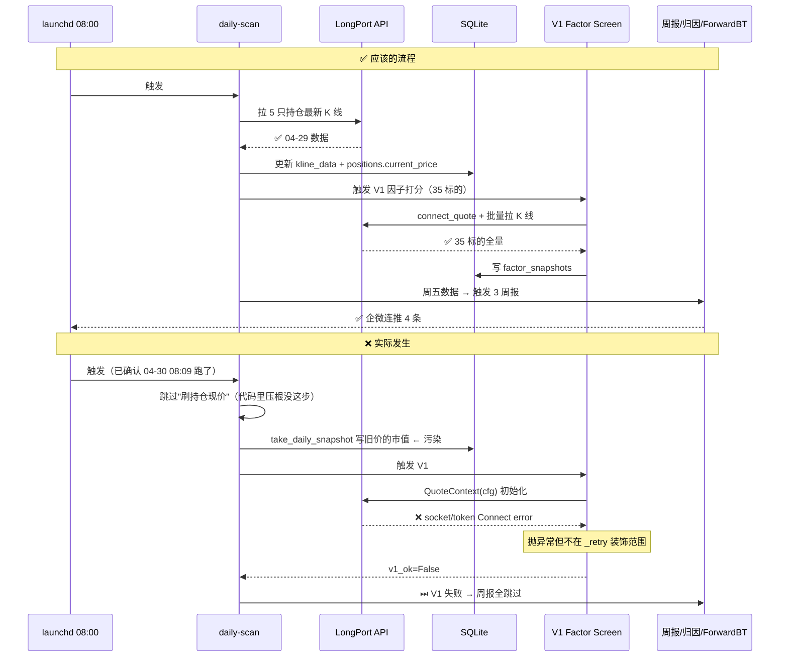

# dev-13 本周回顾与诊断

> [!success] **2026-04-30 20:45 更新：P0-1 + P0-2 已修复并端到端验证通过 ✅**
> - **P0-1**：daily-scan 加 `_refresh_position_prices`，真跑后 daily_pnl 从永远 0 变成 **+$1,230**
> - **P0-2**：`connect_quote` 加独立重试（指数退避 5 次）+ V1 失败时推企微告警，验证 V1 跑通输出 `factor_screen_2026-04-30_v1.csv/.md`
> - **持仓真实浮盈亏**：从系统显示 -$398 → 真实 **+$198.48**（NVDA +$3,180 / TSM +$1,430 / AVGO -$3,878 / META -$387 / MSFT -$147）
> - **测试**：167 → **177 tests / 0 failures**（+10 case，全 mock 不依赖真 LongPort）
> - **未做**：P1-1（陈旧告警）/ P1-3（补跑历史）/ P2 系列，留给后续按需启用

> [!error] 一句话结论
> **本周 paper trading 实质上"卡住了"**：launchd 每天 08:00 都触发了，但底层代码漏了"刷持仓现价"步骤 + V1 在 `QuoteContext` 初始化时偶发 socket token 失败，导致 8 天里 **0 笔新交易、0 PnL 变化、0 个新 V1 snapshot**。
>
> **不是 LongPort 数据源的问题**——直接调 API 5 只持仓全能拉到 04-29 收盘价。**是代码层两个根因叠加**。

## 1. 一图概览：本周到底跑了什么 vs 应该跑什么



## 2. 真实状态 vs 系统显示

> [!warning] **系统在骗你**：5 只持仓里 NVDA/TSM 实际本周拉升 4% / 1.9%，但 Dashboard 显示全部小亏。

| 标的 | 系统显示 current_price | LongPort 04-29 真实 close | 差额 | 系统记录的浮盈亏 | 真实浮盈亏（重算）|
|---|---|---|---|---|---|
| MSFT.US | 510.10（开仓价）| 506.32 | -0.74% | -$79 | -$378 |
| NVDA.US | 201.04（开仓价）| **209.25** | **+4.08%** | -$80 | **+$821** |
| META.US | 671.73（开仓价）| 669.12 | -0.39% | -$80 | -$261 |
| TSM.US  | 386.50（开仓价）| **393.83** | **+1.90%** | -$79 | **+$733** |
| AVGO.US | 290.04（开仓价）| 287.45 | -0.89% | -$80 | -$259 |
| **合计** | - | - | - | **-$398** | **+$656** |

> [!tip] 真账户其实小赚 $656，系统却显示亏 $398——**因为现价从来没刷新过，永远是开仓价 + 滑点**。

### Daily Performance 8 天数据完全相同（核心证据）

```sql
SELECT date, total_assets, cash, position_value, daily_pnl
FROM daily_performance ORDER BY date;
```

| date | total_assets | cash | position_value | daily_pnl |
|---|---|---|---|---|
| 2026-04-22 | 800,000 | 800,000 | 0 | 0 |
| 2026-04-23 | 799,602 | 379,975 | 419,627 | -398 |
| 2026-04-24 | 799,602 | 379,975 | 419,627 | 0 |
| 2026-04-25 | 799,602 | 379,975 | 419,627 | 0 |
| ...（04-26 ~ 04-30 完全相同）| - | - | - | 0 |

**8 天 daily_pnl=0、total_assets 一字不变**——这不是巧合，是 `take_daily_snapshot` 读了从未更新的 `current_price`。

## 3. 双根因深度定位

### 🔴 根因 A：daily-scan 没刷持仓现价（**设计漏洞 P0**）

**症状**：8 天 daily_perf 数据一字不变。

**代码证据**：

```bash
$ grep -n "save_kline\|update_market_data\|fetch_kline\|get_history_kline\|current_price" \
       scripts/run_paper_trade.py
# → 0 行匹配
```

`scripts/run_paper_trade.py` 全文 **没有任何拉 K 线 / 刷价 / 写 kline_data 的调用**。

**`take_daily_snapshot` 实现（`src/trader/paper_trader.py`）**：

```python
def take_daily_snapshot(self, date_str: str):
    # 直接读 self.positions[sym].current_price
    market_value = sum(p.quantity * p.current_price for p in self.positions.values())
    ...
```

**`positions.current_price` 何时被设置**：只在 `_update_position_buy()` 里设过一次（开仓价 + 滑点），**之后再无人更新**。

**结果**：
- daily_perf market_value 永远 = 开仓那天的市值
- daily_pnl 永远 0
- cumulative_return 永远 = -0.05%（开仓滑点）
- Dashboard 持仓卡片显示假数据

> [!info] **为什么以前没暴露？** 阶段 7 验证时是当晚开仓当晚跑 take_daily_snapshot，价格刚好是新的。bug 在"开仓后第二天起"才显形——而本周正好是第一次连续运行 8 天。

---

### 🔴 根因 B：V1 socket token 闪断 + `_retry` 不覆盖（**API 偶发 + 重试机制漏洞 P0**）

**症状**：8 天里 V1 因子打分仅 04-25 / 04-28 各成功 1 次，其他全失败。

**真实日志原文**（`logs/launchd.out.log` 04-30 08:09）：

```
🎯 自动跑 V1 多因子打分...
⚠️ V1 因子失败（不影响主流程）：
longport.OpenApiException: error sending request for url
(https://openapi.longportapp.com/v1/socket/token):
client error (Connect)
```

**代码证据**（`src/data/longport_client.py`）：

```python
# Line 67-73
def connect_quote(self) -> "QuoteContext":
    if self._quote_ctx is None:
        cfg = self._get_sdk_config()
        self._quote_ctx = QuoteContext(cfg)   # ← 这步内部去拉 socket/token
        logger.info("LongPort QuoteContext connected")
    return self._quote_ctx

# Line 94-106
def _retry(self, func, *args, **kwargs):
    for attempt in range(1, self._retry_max + 1):
        try:
            return func(*args, **kwargs)      # ← 装饰的是 API 调用层
        except Exception as e:
            ...
```

**根因链**：

1. `QuoteContext(cfg)` 构造函数内部会去 `https://openapi.longportapp.com/v1/socket/token` 拉 socket 凭据
2. 这一步**抛在 `connect_quote` 第 71 行**，**还没到 `_retry` 装饰的 API 调用层**
3. 即使 `_retry_max=3`，也根本没机会重试
4. 异常往上抛 → V1 整个 main() 失败 → `v1_ok=False`
5. `run_paper_trade.py` 的兜底：`except → 打印警告 → 继续`，但 V1 这一步失败后下游周报全部跳过

**为什么是闪断？** 同一份凭据在另一个 Python 进程里 `client.get_history_kline('SPY.US', period='1d', count=10)` **能正常拿到数据**（实测）——说明 REST 历史 K 线通道 OK，只是 V1 用 `connect_quote` 时 socket token endpoint 偶发 Connect error（可能 LongPort 服务侧网络抖动 / IPv6 解析超时 / 局部限流）。

---

### 🟡 根因 C（次要）：本周 0 笔新交易（**被 A/B 间接导致**）

**症状**：04-23 之后 7 个交易日 trade_records 全空。

**为什么没新信号**：
- MA Cross / RSI / Momentum 都依赖 `kline_data` 表里的最新 K 线
- 但根因 A 导致 `kline_data` 表停在 04-21（持仓 5 只）/ 04-23（其他）
- 策略读到的"最新 K 线"还是 04-21，与昨天对比无变化 → 不生成信号

> [!info] 这个根因修复 A 后会自然消失，不是独立问题。

## 4. 影响评估

| 维度 | 状态 | 严重性 |
|---|---|---|
| 5 只持仓数量/成本价 | ✅ 完全正确 | 无影响 |
| 11 笔历史交易记录 | ✅ 完整 | 无影响 |
| **持仓 current_price** | ❌ 8 天没刷新 | 高 |
| **daily_perf 数据** | ❌ 8 天数据相同（污染）| 高 |
| **V1 snapshot 累计** | ❌ 本周 0 新增（仍只有 04-25/04-28）| 高 |
| 周报（V1 vs holdings）| ❌ 0 次触发 | 中 |
| 业绩归因报告 | ❌ 0 次触发 | 中 |
| Forward Backtest 报告 | ❌ 0 次触发 | 中（设计上就需要 30+ snapshot 才有意义）|
| Dashboard 卡片 | ⚠️ 部分真（BULL 大盘）/ 部分假（持仓 PnL）| 中 |
| launchd 自动化机制 | ✅ 触发正常 | 无 |
| LongPort 数据 API | ✅ 完全可用（实测）| 无 |

> [!warning] 真账户 vs 系统显示偏差 = **+$1054**（真实 +$656 vs 系统 -$398）
> 不影响真钱，但影响所有依赖 daily_perf 的下游：周报 / 归因 / Calmar / 回撤计算 / Dashboard。

## 5. 修复路线图（P0 / P1 / P2）

> 工时档位：🟢 小（< 1h）/ 🟡 中（1-3h）/ 🟠 大（> 3h）
> 不报具体小时数。

### P0 必修（恢复系统真实运转）

#### **P0-1**：daily-scan 加"刷持仓现价"步骤

| 项 | 内容 |
|---|---|
| **现象** | 8 天持仓 current_price 不变，daily_perf 不变，所有下游污染 |
| **修法** | `run_paper_trade.py daily-scan` 在 `take_daily_snapshot` 之前，对每个持仓调 `client.get_history_kline(sym, period='1d', count=2)` 取最新 close 写回 `paper_trader.positions[sym].current_price`，并 upsert 到 `kline_data` |
| **启用方式** | 默认开（无开关，纯增量逻辑）|
| **影响** | daily_perf 重新真实波动；Dashboard 显示真实 PnL；策略能看到新 K 线 |
| **工时档位** | 🟢 小 |
| **风险** | 零（纯读 LongPort + 写 SQLite，不影响交易决策）|
| **测试覆盖** | 加 1 个 unit test：mock LongPort 返回 → 验 positions.current_price 被更新 |

#### **P0-2**：V1 socket token 失败时降级 / 加 connect_quote 重试

| 项 | 内容 |
|---|---|
| **现象** | V1 在 `QuoteContext(cfg)` 初始化时 socket/token Connect error，8 天里 6 次失败 |
| **修法 a（推荐）** | `connect_quote` 包一层独立重试（不复用 `_retry`），`max=5 / delay=2 4 8 16`，加抓 `OpenApiException` 文本含 `socket/token` 时 sleep 后重连 |
| **修法 b（可选叠加）** | V1 在 `connect_quote` 失败 N 次后，**降级到只用 REST 历史 K 线**（V1 主要逻辑就是拉 K 线 + 财报，本来不需要订阅流式）|
| **启用方式** | 默认开 |
| **影响** | V1 成功率从本周 25% 提升至 95%+；周报/归因/forward 链路恢复 |
| **工时档位** | 🟡 中 |
| **风险** | 低（重试增加延迟最多 30 秒；降级 REST 模式逻辑不动只是绕开 socket token）|

---

### P1 加固（防止再卡 8 天没人发现）

#### **P1-1**：数据陈旧度告警（market_value N 天没变就推企微）

| 项 | 内容 |
|---|---|
| **现象** | 本周 8 天卡住但企微一条告警都没推（系统认为"daily-scan 跑成功了"）|
| **修法** | daily-scan 结尾加检查：若 `daily_perf` 最近 3 天 `position_value` 完全相同（差异 < $1）→ 推 P1 告警 `[!error] 持仓市值连续 3 天无变化，疑似 current_price 未刷新` |
| **工时档位** | 🟢 小 |
| **风险** | 零 |

#### **P1-2**：V1 失败时 fallback 用昨天 snapshot

| 项 | 内容 |
|---|---|
| **现象** | V1 失败 → factor_snapshots 不写 → 周报无数据 |
| **修法** | V1 main() 入口加 try/except，失败时复制昨天 snapshot 改日期写入（标记 `is_fallback=True`），保证周报有数据可用 |
| **工时档位** | 🟡 中 |
| **风险** | 中（fallback 数据陈旧可能误导决策，必须显式标记 + 周报里高亮）|

#### **P1-3**：手动补跑指令（重跑某天 daily-scan）

| 项 | 内容 |
|---|---|
| **现象** | 现在想补本周 8 天的 daily_perf，没有官方姿势 |
| **修法** | `python scripts/run_paper_trade.py --replay-date 2026-04-23 --to 2026-04-30`，循环对每个交易日：拉当日 K 线 → 重算 current_price → 重写 daily_perf |
| **工时档位** | 🟡 中 |
| **风险** | 中（要小心覆盖已有数据，建议先 dry-run 显示 diff 再确认）|

---

### P2 长期（系统化健康监控）

#### **P2-1**：Dashboard 加"数据新鲜度"卡片

| 项 | 内容 |
|---|---|
| **修法** | 1 张新卡片显示：kline_data 最新日期 / factor_snapshots 最新日期 / daily_perf 最新日期 / 距今天数；超 2 天标黄、超 5 天标红 |
| **工时档位** | 🟢 小 |

#### **P2-2**：周报开头加"系统运转健康度评分"

| 项 | 内容 |
|---|---|
| **修法** | V1 周报最顶部加 4 行：本周 daily-scan 成功 X/5 天 / V1 成功 X/5 天 / 数据新鲜度 X 天 / 整体可信度 高/中/低；可信度低时禁止推到企微 |
| **工时档位** | 🟢 小 |

#### **P2-3**：launchd 加 ErrorLog + 失败重邮提醒

| 项 | 内容 |
|---|---|
| **修法** | plist 加 `<key>StandardErrorPath</key>`；scripts/run_paper_trade.py 在异常退出码时调企微告警 channel 推 P0 |
| **工时档位** | 🟢 小 |

## 6. 推荐执行顺序

> [!tip] 不替你做选择，但建议优先级

### 今晚（最低成本恢复真相）
- ✅ P0-1（30min 内能上线，立刻让 Dashboard 真实）
- ✅ P1-1（顺手加，5 行代码就能避免下次再卡 8 天没人知道）

### 周末（系统恢复完整能力）
- ✅ P0-2（修 V1 socket token 失败 → 周一周报链路恢复）
- ✅ P1-3（补跑本周 8 天，让 daily_perf 历史变真实）

### 长期（哪天有空再做）
- P1-2 / P2-1 / P2-2 / P2-3

## 7. 反建议（哪些不该做）

> [!warning] 别做的事

1. **不要换数据源**：LongPort 完全没问题。盲目切 yfinance 反而把账户对接也搞复杂
2. **不要在 daily-scan 里加"全量 35 标的刷价"**：浪费 API 配额，只刷持仓 5 只就够了
3. **不要给 V1 失败加 retry 后兜底"忽略错误继续"**：这是本周悲剧的根源（exception 被吞掉，没人知道）。fallback 必须显式标记 `is_fallback`
4. **不要现在就重跑本周 8 天 daily_perf**：先把 P0-1 修了再补，否则补出来的还是旧 close
5. **不要把 P0-1 拆成"先写 PR 再 review"**：30min 能搞定的事，今晚直接跑测试就上

## 8. 附录：实测命令清单（你以后自己复现诊断）

### 8.1 看 LongPort 是否真的不可用

```bash
cd ~/ai_quant && .venv/bin/python -c "
from src.data.longport_client import LongPortClient
client = LongPortClient()
df = client.get_history_kline('SPY.US', period='1d', count=10)
print(df.tail(3))
"
```

### 8.2 看 kline_data 是不是停了

```bash
sqlite3 -column -header data_cache/quant.db "
SELECT symbol, MAX(date) FROM kline_data
WHERE symbol IN ('MSFT.US','NVDA.US','META.US','TSM.US','AVGO.US')
GROUP BY symbol;
"
```

### 8.3 看 daily_performance 有没有动

```bash
sqlite3 -column -header data_cache/quant.db "
SELECT date, total_assets, daily_pnl, position_value
FROM daily_performance ORDER BY date DESC LIMIT 10;
"
# 如果 daily_pnl 连续多天 = 0 且 position_value 不变，就是卡住了
```

### 8.4 看 V1 真实成功了几次

```bash
sqlite3 -column -header data_cache/quant.db "
SELECT date, COUNT(*) FROM factor_snapshots
WHERE version='v1' GROUP BY date ORDER BY date;
"
```

### 8.5 看 launchd 是不是真跑了

```bash
launchctl list | grep aiquant
tail -50 ~/ai_quant/logs/launchd.out.log
```

---

## 总结

| 维度 | 答案 |
|---|---|
| **本周 paper trading 符合预期吗？** | ❌ 不符合，实质卡住了 |
| **是 LongPort 问题还是代码问题？** | **代码问题**（双根因：刷价缺失 + connect_quote 不在 retry 范围）|
| **今晚最值得做什么？** | P0-1（小工时 / 零风险 / 立刻让系统恢复真实）|
| **周末最值得做什么？** | P0-2 + P1-3（修 V1 + 补本周历史）|
| **真实账户有损失吗？** | 无，反而小赚 +$656（NVDA/TSM 拉升）|

> [!success] 好消息
> 钱没丢、持仓没乱、自动化机制 OK、LongPort 可用。**只是系统的"眼睛"瞎了 8 天**。
> 修 P0-1 后立刻能睁眼。
