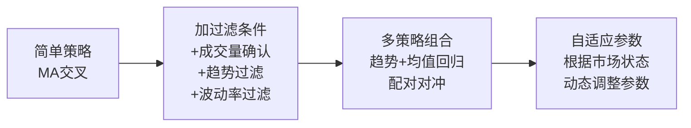

# 📊 美股量化交易系统 — 知识图谱与搭建路线图

> [!info] Gavin 专属版
> 基于已有基础（长桥 API + GOOGL/META 回测经验），量身定制的学习与搭建路径。

---

## 一、需要掌握的知识体系

### 1. 金融市场基础

| 领域 | 关键知识点 | 现状 |
|------|-----------|------|
| 美股市场结构 | 交易时段（北京时间 21:30-4:00/夏令时）、盘前盘后交易、T+0 制度、无涨跌幅限制 | ✅ 有经验 |
| 订单类型 | Market / Limit / Stop / Stop-Limit / Trailing Stop | 需确认 |
| 费用结构 | 佣金、SEC Fee、ADR Fee、融资利率 | 需梳理 |
| 财报日历 | 美股财报季（1/4/7/10月）、盘前盘后发布的影响 | ✅ 有经验 |

> [!tip] 深入学习
> 详见 → [[ln-02_美股市场结构与交易规则]] ✅ 已完成

### 2. 量化策略核心知识

#### 2.1 技术分析类策略

- **趋势跟踪**：MA交叉策略、MACD、布林带突破、海龟交易法
- **均值回归**：RSI 超买超卖、布林带回归、配对交易（Pair Trading）
- **动量策略**：相对强弱动量、截面动量（选股）、时间序列动量
- **波动率策略**：ATR 通道突破、波动率扩张/收缩

#### 2.2 基本面量化

- **多因子模型**：价值因子(PE/PB)、质量因子(ROE)、成长因子(Revenue Growth)、动量因子
- **财报事件驱动**：财报超预期(Earnings Surprise)策略、SUE 因子
- **另类数据**：新闻情绪、社交媒体情绪、内部人交易

#### 2.3 统计与机器学习

- **时间序列分析**：ARIMA、GARCH（波动率建模）
- **机器学习**：随机森林、XGBoost 做收益预测；聚类做行业轮动
- **深度学习**：LSTM 做序列预测（谨慎使用，容易过拟合）

> [!tip] 深入学习
> 每类策略后续会有独立笔记：
> - [[ln-03_技术指标与趋势策略]] ✅ 已完成
> - [[ln-04_均值回归与动量策略]] ✅ 已完成
> - [[ln-05_多因子模型与基本面量化]] ✅ 已完成

### 3. 风险管理

> [!warning] 风控第一
> 量化最重要的不是赚多少，而是控制亏损。任何策略必须先讨论最大回撤和止损逻辑。

| 风控层级 | 内容 | 关键指标 |
|---------|------|---------|
| **单笔交易** | 止损位设定、头寸大小计算 | 单笔最大亏损 ≤ 总资金 1-2% |
| **组合层面** | 相关性管理、行业/板块集中度 | 最大回撤 < 15-20% |
| **系统层面** | 策略失效检测、黑天鹅保护 | 连续亏损次数上限、日内最大亏损限额 |

### 4. 编程与工程能力

| 技能 | 工具/框架 | 用途 |
|------|----------|------|
| Python 核心 | `pandas`, `numpy` | 数据处理 |
| 回测框架 | `backtrader` / `zipline` / 自建 | 策略验证 |
| 数据获取 | 长桥 API / Yahoo Finance / Tushare | K线、基本面 |
| 可视化 | `matplotlib`, `plotly` | 回测报告 |
| 实盘对接 | 长桥 OpenAPI | 下单、持仓管理 |
| 任务调度 | `APScheduler` / `cron` | 自动化运行 |

---

## 二、系统架构设计

### 整体架构图

```
┌─────────────────────────────────────────────────────────┐
│                    美股量化交易系统                        │
├─────────────┬──────────────┬──────────────┬──────────────┤
│  数据层      │  策略层       │  执行层       │  监控层      │
│             │              │              │              │
│ · K线数据    │ · 信号生成    │ · 订单管理    │ · 实时仪表盘  │
│ · 基本面数据  │ · 仓位计算    │ · 风控检查    │ · 策略状态    │
│ · 另类数据   │ · 回测引擎    │ · 长桥API对接  │ · 报警通知    │
│ · 实时行情   │ · 策略评估    │ · 滑点模拟    │ · 每日报告    │
└─────────────┴──────────────┴──────────────┴──────────────┘
```

### 推荐项目结构

```
ai_quant/
├── config/                  # 配置文件
│   ├── settings.yaml        # 全局设置（API密钥、交易参数）
│   └── strategies.yaml      # 策略参数配置
├── data/                    # 数据存储
│   ├── raw/                 # 原始数据（K线CSV等）
│   ├── processed/           # 清洗后的数据
│   └── cache/               # API缓存
├── strategies/              # 策略模块
│   ├── base.py              # 策略基类（统一接口）
│   ├── ma_cross.py          # MA交叉策略
│   ├── momentum.py          # 动量策略
│   └── mean_reversion.py    # 均值回归策略
├── engine/                  # 核心引擎
│   ├── backtester.py        # 回测引擎
│   ├── portfolio.py         # 组合管理
│   ├── risk_manager.py      # 风控模块
│   └── order_manager.py     # 订单管理
├── data_feed/               # 数据获取
│   ├── longbridge.py        # 长桥API封装
│   ├── yahoo.py             # Yahoo Finance
│   └── news_sentiment.py    # 新闻情绪数据
├── analysis/                # 分析工具
│   ├── performance.py       # 绩效分析
│   ├── param_sensitivity.py # 参数敏感性分析
│   └── report_generator.py  # 回测报告生成
├── live/                    # 实盘模块
│   ├── trader.py            # 实盘交易主程序
│   ├── monitor.py           # 监控与告警
│   └── scheduler.py         # 定时任务调度
├── notebooks/               # Jupyter 探索性分析
├── tests/                   # 单元测试
└── requirements.txt
```

---

## 三、搭建路线 — 五阶段迭代法

### Phase 1: 数据基础设施（1-2周）

> [!abstract] 目标
> 建立可靠的数据获取和管理体系

- [ ] 封装长桥 API — 统一接口获取K线、实时行情、财务数据
- [ ] 数据清洗管道 — 处理停牌、拆股、分红等异常
- [ ] 本地数据库 — SQLite / DuckDB 存储历史数据
- [ ] 数据验证 — 确保数据质量（缺失值、异常值检测）

**关键产出**：能用一行代码拉取任意美股的清洗后历史数据

### Phase 2: 回测引擎（2-3周）

> [!abstract] 目标
> 搭建一个靠谱的回测框架

- [ ] 回测核心 — 事件驱动架构，支持逐K线回放
- [ ] 手续费模型 — 佣金 + SEC Fee + 滑点
- [ ] 绩效指标 — 年化收益、夏普比率、最大回撤、胜率、盈亏比
- [ ] 参数敏感性分析 — 网格搜索 + 热力图可视化
- [ ] 过拟合检测 — 样本内/外分割、Walk-Forward Analysis
- [ ] 回测报告 — 自动生成含图表的 HTML 报告

**关键产出**：能对任意策略一键回测，输出专业报告

### Phase 3: 策略开发与验证（持续迭代）

> [!abstract] 目标
> 从简单到复杂，逐步开发策略

**开发顺序（推荐）：**

| Level | 策略类型 | 具体策略 |
|-------|---------|---------|
| 1 | 单指标策略 | [[MA交叉策略]]（优化参数）、RSI 超买超卖、布林带突破 |
| 2 | 多指标组合 | MACD + RSI 过滤、趋势 + 波动率、动量 + 均值回归对冲 |
| 3 | 多因子选股 | 价值 + 动量因子、财报事件驱动、行业轮动 |
| 4 | 机器学习增强 | 特征工程、XGBoost 收益预测、集成学习 + 策略组合 |

> [!important] 每个策略的验证流程
> `设计 → 回测 → 参数敏感性 → 过拟合检测 → 样本外验证 → 模拟盘 → 小仓位实盘`
> 任何一步不通过，就回到上一步迭代。

### Phase 4: 实盘系统

> [!abstract] 目标
> 策略通过验证后，接入实盘

- [ ] 模拟盘运行 — 长桥模拟账户，跑至少 1 个月
- [ ] 风控系统 — 最大亏损限额、异常检测、紧急停止
- [ ] 订单执行 — 限价单优先、滑点监控、部分成交处理
- [ ] 定时任务 — 盘前数据更新、盘中信号检测、盘后结算
- [ ] 告警通知 — 微信/邮件推送交易信号和异常

### Phase 5: 监控与进化（长期）

- [ ] 策略绩效追踪 — 实盘 vs 回测偏差监控
- [ ] 策略失效检测 — 滚动夏普比率、盈利因子衰减
- [ ] 新策略研发 — 另类数据、AI 模型、事件驱动
- [ ] 系统升级 — 多账户、多市场、组合优化

---

## 四、策略迭代升级方法论

### 核心理念：升级不是"换策略"，是"加维度"



### 策略评估标准（不只看收益）

| 指标 | 合格线 | 优秀线 | 说明 |
|------|--------|--------|------|
| 年化收益 | > 15% | > 25% | 必须跑赢标普 500 |
| 夏普比率 | > 1.0 | > 1.5 | 风险调整后收益 |
| 最大回撤 | < 20% | < 15% | 能承受的最大亏损 |
| 胜率 | > 40% | > 50% | 配合盈亏比看 |
| 盈亏比 | > 1.5 | > 2.0 | 赚多少 / 亏多少 |
| 交易次数 | > 30/年 | > 50/年 | 太少则统计意义不足 |
| Calmar 比率 | > 1.0 | > 2.0 | 年化收益 / 最大回撤 |

#### 📌 夏普比率（Sharpe Ratio）

衡量**赚得稳不稳**——每承担 1 单位风险能换多少超额收益。

```
夏普 = (年化收益 - 无风险利率) / 年化波动率
无风险利率 ≈ 4%（美国国债收益率）
```

> [!tip] 判读口诀
> - 同样年化 20%，夏普 2.0 走平滑曲线，夏普 0.5 走过山车
> - **夏普低的策略拿不住**，即使收益一样

#### 📌 Calmar 比率（Calmar Ratio）

衡量**最惨情况下的性价比**——赚的钱值不值最大回撤那次痛。

```
Calmar = 年化收益 / |最大回撤|
```

> [!tip] 夏普 vs Calmar
> - **夏普**看平时波动（日常舒适度）
> - **Calmar**看最坏情况（生存底线）
> - 散户更看重 Calmar，因为回撤太大会直接砍仓放弃策略

### 避坑指南

> [!danger] 六大常见陷阱

| 陷阱 | 表现 | 解决方案 |
|------|------|---------|
| **过拟合** | 回测完美，实盘亏钱 | Walk-Forward 验证、样本外测试 |
| **前视偏差** | 用了未来数据 | 严格按时间顺序，信号延迟一根K线执行 |
| **幸存者偏差** | 只回测现存股票 | 用含退市股的数据集 |
| **滑点低估** | 忽略交易成本 | 模拟真实滑点（1-3 个 tick） |
| **小样本** | 只测了 1-2 只股票 | 跨多只股票、多个时间段验证 |
| **参数敏感** | 微调参数结果巨变 | 找"稳定高原"而非"尖锐山峰" |

---

## 五、下一步行动

### 立即开始（本周）

- [ ] 重构现有项目结构 — 按上面的架构整理 `~/ai_quant/`
- [ ] 升级 [[MA交叉策略]] — 加成交量过滤、趋势过滤、参数敏感性分析
- [ ] 扩大股票池 — 至少覆盖 FAANG + 高波动标的

### 短期目标（2-4周）

- [ ] 搭建完整回测引擎，支持一键出报告
- [ ] 开发 2-3 个基础策略，横向对比
- [ ] 建立参数敏感性分析工具

---

## 相关笔记

### 已有笔记（Vault 内）
- [[dev-00-系统概览]] — 项目整体架构与技术栈
- [[dev-01-环境搭建]] — 开发环境配置
- [[dev-02-数据层设计]] — 数据源与存储方案
- [[dev-03-策略设计]] — 策略逻辑说明
- [[dev-04-回测记录]] — 回测结果汇总
- [[dev-05-风控规则]] — 风控规则与阈值
- [[dev-06-模拟交易日志]] — 模拟交易记录
- [[dev-07-实盘交易日志]] — 实盘交易记录

### 量化学习笔记（已完成）
- [[ln-02_美股市场结构与交易规则]] ✅ — 交易规则、费用、熔断
- [[ln-03_技术指标与趋势策略]] ✅ — MA/MACD/布林带/ATR/ADX
- [[ln-04_均值回归与动量策略]] ✅ — RSI/配对交易/截面动量
- [[ln-05_多因子模型与基本面量化]] ✅ — 因子选股/财报事件驱动
- [[ln-06_风险管理与仓位控制]] ✅ — 止损/仓位/凯利公式/熔断
- [[ln-07_回测方法论与过拟合防范]] ✅ — Walk-Forward/参数敏感性
- [[ln-08_Python量化工具链]] ✅ — pandas/backtrader/长桥API

> [!note] 笔记互联说明
> 灰色的 `[[双链]]` 表示笔记尚未创建，后续学习中会逐步补齐，Obsidian 会自动建立关联图谱。
