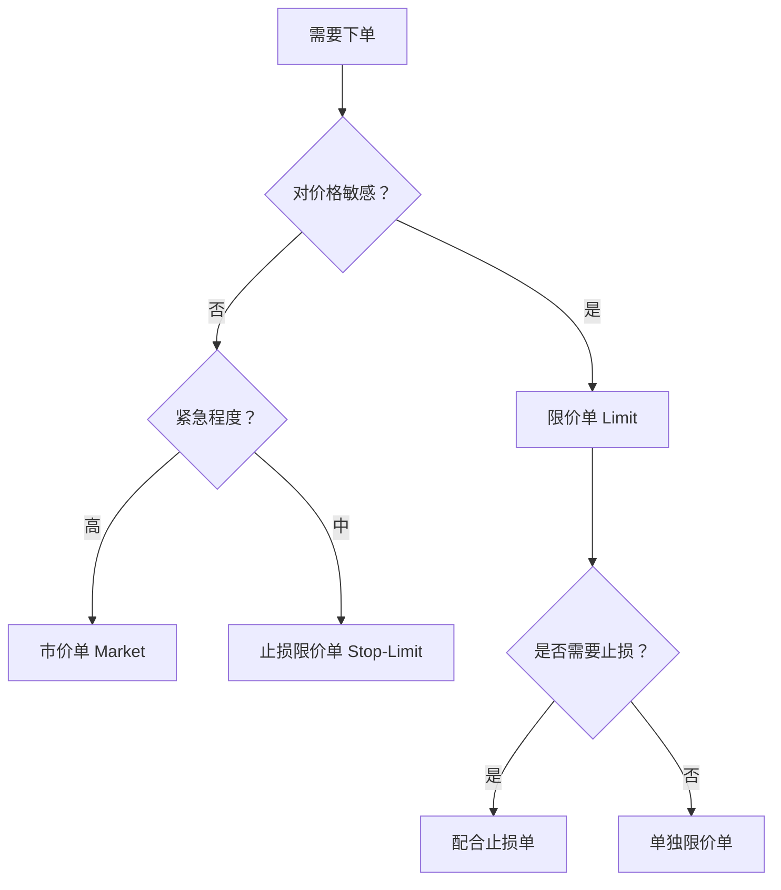

# 📈 美股市场结构与交易规则

> [!info] 为什么要学这个？
> 量化系统的每一行代码都建立在市场规则之上。交易时段决定了你的调度逻辑，订单类型决定了你的下单策略，费用结构直接影响回测的真实性。**搞错规则 = 回测失真 = 实盘亏钱。**

---

## 一、美股市场概览

### 1.1 主要交易所

| 交易所        | 全称                                                              | 特点                 | 代表股票                                      |
| ---------- | --------------------------------------------------------------- | ------------------ | ----------------------------------------- |
| **NYSE**   | New York Stock Exchange                                         | 全球最大，上市标准严格，传统蓝筹为主 | BRK, JPM, WMT, KO                         |
| **NASDAQ** | National Association of Securities Dealers Automated Quotations | 电子化交易，科技股集中        | AAPL, MSFT, GOOGL, META, AMZN, NVDA, TSLA |
| **AMEX**   | American Stock Exchange (现 NYSE American)                       | 中小盘股、ETF           | SPY, QQQ                                  |

> [!tip] 量化系统关注点
> 不同交易所的股票代码格式一致（纯字母），但**流动性差异很大**。量化选股池应优先选择日均成交额 > 1000 万美元的标的，避免滑点过大。

### 1.2 主要指数

| 指数 | 成分 | 用途 |
|------|------|------|
| **S&P 500** | 500 只大盘股，市值加权 | 最常用的基准（Benchmark），策略收益必须跑赢它 |
| **NASDAQ 100** | 100 只非金融大盘科技股 | 科技策略基准 |
| **Dow Jones 30** | 30 只蓝筹，价格加权 | 参考价值有限，但市场情绪指标 |
| **Russell 2000** | 2000 只小盘股 | 小盘策略基准 |
| **VIX** | 标普500期权隐含波动率 | 恐慌指数，波动率策略核心参考 |

---

## 二、交易时段（北京时间）

### 2.1 常规交易时段

| 时段       | 夏令时（3月中-11月初）     | 冬令时（11月初-3月中）     |
| -------- | ----------------- | ----------------- |
| **盘前交易** | 16:00 - 21:30     | 17:00 - 22:30     |
| **正式交易** | 21:30 - 04:00（次日） | 22:30 - 05:00（次日） |
| **盘后交易** | 04:00 - 08:00     | 05:00 - 09:00     |

> [!warning] 量化系统时间处理
> - 所有时间戳统一用 **UTC** 存储，显示时再转换
> - 必须处理**夏令时切换**（每年两次），否则调度任务会错位
> - Python 推荐使用 `pytz` 或 `zoneinfo` 处理时区：
> ```python
> from zoneinfo import ZoneInfo
> eastern = ZoneInfo("America/New_York")
> ```

> [!note] 美股无午休
> 正式交易 6.5 小时连续进行，不像 A股/港股有午间休市。
> 但美东午间（北京时间 00:00-02:00）流动性明显下降，呈现「U型成交量曲线」——开盘/收盘高，午间低。

> [!tip] 24 小时交易（2024+ 新增）
> NYSE/NASDAQ 推出过夜时段（美东 20:00-04:00 / 北京 08:00-16:00），但：
> - 仅支持少数大盘股（SPY/QQQ/FAANG 等）
> - 流动性极低、点差极大
> - 只接受限价单，不计入官方 OHLC
>
> **量化建议：不用。** 滑点会吃掉策略收益。

### 2.2 盘前盘后交易特点

| 特性 | 盘前/盘后 | 正式交易 |
|------|----------|---------|
| 流动性 | 很低 | 高 |
| 价差(Spread) | 大 | 小 |
| 订单类型 | 通常只支持限价单 | 全类型 |
| 波动性 | 极高（财报发布时） | 相对稳定 |
| 适合量化? | ⚠️ 谨慎 | ✅ 推荐 |

> [!important] 对量化系统的影响
> - **财报发布**通常在盘前或盘后，价格剧烈波动，回测时需要考虑这一点
> - 盘前盘后**滑点极大**，初期策略建议只在正式交易时段操作
> - 长桥 API 支持盘前盘后交易，但需要在订单中指定 `outside_rth=True`

### 2.3 休市日

- **固定假期**：新年、马丁·路德·金日、总统日、耶稣受难日、阵亡将士纪念日、独立日、劳动节、感恩节、圣诞节
- **提前收盘**：感恩节前一天、圣诞节前一天（通常 13:00 ET 收盘）

> [!tip] 代码实现
> 使用 `exchange_calendars` 库获取精确的交易日历：
> ```python
> import exchange_calendars as xcals
> nyse = xcals.get_calendar("XNYS")
> # 判断某天是否为交易日
> nyse.is_session("2026-04-17")
> # 获取下一个交易日
> nyse.next_session("2026-04-17")
> ```

---

## 三、交易规则

### 3.1 T+0 制度

| 规则 | 说明 |
|------|------|
| **买入** | 即时生效，可立即卖出 |
| **卖出** | 资金 T+1 结算（原来 T+2，2024年5月起改为 T+1） |
| **日内交易** | 同一天买入并卖出同一只股票 = 1 次日内交易（Day Trade） |

> [!danger] PDT 规则（Pattern Day Trader）
> 如果你的**保证金账户**在**连续 5 个交易日内执行了 4 次及以上日内交易**，账户会被标记为 PDT。
>
> **后果**：账户净值必须维持在 **$25,000 以上**，否则将被限制日内交易 90 天。
>
> **对量化系统的影响**：
> - 如果初始资金 < $25,000，策略必须**避免频繁日内交易**
> - 可以用**现金账户**（Cash Account）规避 PDT，但受 T+1 结算限制
> - 建议：初期用**模拟盘**不受此限制，实盘确保资金 > $25,000

### 3.2 无涨跌幅限制 + 熔断机制

美股**没有涨跌停板**，但有以下保护机制：

#### 个股熔断（LULD - Limit Up-Limit Down）

| 股价区间 | 波动限制 |
|---------|---------|
| > $3.00 | ±5%（S&P 500 成分股）/ ±10%（其他） |
| $0.75 - $3.00 | ±20% |
| < $0.75 | ±75% 或 $0.15（取较小值） |

- 触及限制后进入 **15 秒暂停期**
- 暂停期内只接受限制价格范围内的订单

#### 市场熔断（Circuit Breaker）

| 级别 | 标普500跌幅 | 触发时间 | 措施 |
|------|-----------|---------|------|
| Level 1 | -7% | 15:25 前 | 暂停交易 15 分钟 |
| Level 2 | -13% | 15:25 前 | 暂停交易 15 分钟 |
| Level 3 | -20% | 任何时间 | **当日停止交易** |

> [!warning] 量化风控必须考虑
> - 熔断期间**无法下单**，系统必须处理下单失败的情况
> - 个股 LULD 暂停会导致**滑点极大**或**无法成交**
> - 回测中应模拟这些极端情况

### 3.3 卖空（Short Selling）

| 规则 | 说明 |
|------|------|
| **Uptick Rule (SSR)** | 当股票日内跌幅超过 10% 时触发，次日生效。触发后只能在**上涨 tick** 时做空 |
| **借券费** | 做空需要借券，热门做空股借券费可能很高（年化 10-100%+） |
| **强制平仓** | 券商可能在借券不足时**强制回补**（Buy-in） |

> [!tip] 对量化系统的影响
> - 如果策略包含做空，必须在回测中加入**借券费**和 **SSR 限制**
> - 初期建议**只做多**，降低复杂度
> - 长桥支持美股做空，但需要单独申请权限

---

## 四、订单类型

### 4.1 基础订单类型

| 类型 | 英文 | 说明 | 适用场景 |
|------|------|------|---------|
| **市价单** | Market Order | 以当前最优价格立即成交 | 追求成交速度，不在意价格 |
| **限价单** | Limit Order | 指定价格或更优价格成交 | 控制成本，量化首选 |
| **止损单** | Stop Order | 价格触及止损价后变为市价单 | 止损保护 |
| **止损限价单** | Stop-Limit Order | 价格触及止损价后变为限价单 | 精确止损，但可能不成交 |
| **追踪止损单** | Trailing Stop | 止损价随股价上涨自动上移 | 趋势跟踪锁定利润 |

### 4.2 订单执行策略对比



### 4.3 量化系统推荐策略

> [!important] 订单策略建议
> 1. **入场**：使用**限价单**，设在最新价附近（±0.1%），兼顾成交率和成本控制
> 2. **止损**：使用**止损限价单**，止损价和限价间留 0.5-1% 缓冲
> 3. **止盈**：使用**限价单**或**追踪止损单**
> 4. **紧急平仓**（风控触发）：使用**市价单**，保命要紧

### 4.4 订单有效期

| 类型 | 英文 | 说明 |
|------|------|------|
| **日内有效** | Day (DAY) | 当日收盘后自动撤销（默认） |
| **撤销前有效** | Good Till Cancelled (GTC) | 持续有效直到成交或手动撤销（通常最长 90 天） |
| **盘前盘后有效** | Extended Hours | 指定在盘前或盘后时段有效 |

---

## 五、费用结构

### 5.1 交易成本明细

| 费用项 | 金额 | 说明 |
|--------|------|------|
| **佣金** | 因券商而异 | 长桥：美股 $0.0049/股，最低 $0.99/单 |
| **SEC Fee** | $8.00 / 百万美元（卖出时） | 美国证券交易委员会收取，仅卖出时 |
| **TAF Fee** | $0.000166/股（最高 $5.95） | FINRA 交易活动费 |
| **ADR Fee** | $0.01-0.05/股/年 | 仅 ADR 股票（如 BABA, TSM） |

### 5.2 回测中的费用模型

> [!important] 真实费用模拟
> 回测必须包含交易成本，否则结果严重失真。

```python
# 推荐的费用模型参数
COMMISSION_PER_SHARE = 0.005   # 佣金/股
MIN_COMMISSION = 1.0            # 最低佣金/单
SEC_FEE_RATE = 8.0 / 1_000_000 # SEC Fee（仅卖出）
SLIPPAGE_PCT = 0.05             # 滑点假设 0.05%

def calculate_cost(shares, price, side):
    """计算单笔交易的总成本"""
    commission = max(shares * COMMISSION_PER_SHARE, MIN_COMMISSION)
    sec_fee = price * shares * SEC_FEE_RATE if side == "sell" else 0
    slippage = price * shares * SLIPPAGE_PCT / 100
    return commission + sec_fee + slippage
```

### 5.3 费用对策略的影响

| 交易频率 | 年交易次数 | 假设每次成本 | 年费用占比（10万美元） |
|---------|-----------|------------|---------------------|
| 低频 | 50 | $5 | 0.25% |
| 中频 | 200 | $5 | 1.00% |
| 高频 | 1000 | $5 | 5.00% |
| 超高频 | 5000 | $5 | 25.00% |

> [!danger] 关键结论
> **交易频率越高，费用吞噬越严重。** 个人量化策略建议控制在**中低频**（年 50-200 次），确保策略的超额收益能覆盖成本。

---

## 六、数据层面的关键知识

### 6.1 股票代码（Ticker）

| 市场 | 格式 | 示例 |
|------|------|------|
| 美股 | 纯字母，1-5 个字符 | AAPL, GOOGL, BRK.B |
| 长桥 API | `{TICKER}.US` | `AAPL.US`, `GOOGL.US` |

> [!tip] 注意事项
> - 部分股票有多个类别：`GOOGL`（A 类有投票权）vs `GOOG`（C 类无投票权）
> - ADR 股票代码与本地市场不同：阿里巴巴在港股是 `9988.HK`，美股是 `BABA`
> - 股票代码会变更（公司改名、合并），回测需用**历史代码映射**

### 6.2 K线数据注意事项

| 问题 | 说明 | 处理方式 |
|------|------|---------|
| **拆股/并股** | 价格和成交量需要复权调整 | 使用**前复权（Adjusted Close）** |
| **分红** | 除息日价格跳空 | 用复权价格消除跳空 |
| **停牌** | 无交易数据 | 用前一日收盘价填充，标记停牌状态 |
| **退市** | 数据截断 | 保留退市股数据，避免幸存者偏差 |

### 6.3 复权说明

```
前复权（Forward Adjusted）：以最新价格为基准，往回调整历史价格
后复权（Backward Adjusted）：以上市日价格为基准，往前调整

量化回测推荐：前复权
原因：与当前市场价格对齐，信号触发价格即为可交易价格
```

---

## 七、对量化系统的设计影响总结

| 市场规则 | 系统设计影响 |
|---------|------------|
| T+0 + PDT | 控制日内交易次数，或确保资金 > $25K |
| 无涨跌停 + LULD | 风控必须设硬止损，处理暂停交易异常 |
| 盘前盘后 | 调度时间精确到分钟，处理夏令时 |
| 费用结构 | 回测必须模拟真实费用 + 滑点 |
| 复权 | 数据层统一使用前复权 |
| 休市日 | 使用 `exchange_calendars` 排除非交易日 |
| 订单类型 | 入场限价单，止损止损限价单，紧急市价单 |

---

## 八、自测清单

> [!question] 学完本节，你应该能回答：

- [x] 美股正式交易时段是北京时间几点到几点？（夏令时 vs 冬令时）
- [x] PDT 规则是什么？对资金量 < $25K 的账户有何影响？
- [x] 市价单和限价单的区别是什么？量化系统一般用哪种？
- [x] LULD 熔断是什么？对量化下单有何影响？
- [x] 回测时为什么必须包含交易费用？费用模型包含哪几项？
- [x] 什么是前复权？为什么量化回测推荐使用前复权？
- [x] 如何用 Python 判断某天是否为美股交易日？

---

## 相关笔记

- [[ln-01_美股量化系统_知识图谱与搭建路线图]] — 总路线图
- [[dev-00-系统概览]] — 系统架构
- [[dev-02-数据层设计]] — 数据层实现
- [[dev-05-风控规则]] — 风控规则设计
- [[ln-03_技术指标与趋势策略]] — 下一节
