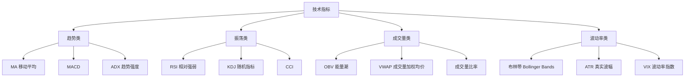

# 📉 技术指标与趋势跟踪策略

> [!info] 本节定位
> 路线图 Phase 3 Level 1 的核心内容。掌握常用技术指标的**计算原理**、**信号逻辑**和**量化实现**，这是所有策略的基础积木。

---

## 一、技术指标分类总览



---

## 二、移动平均线（MA）

### 2.1 类型对比

| 类型 | 英文 | 公式特点 | 优缺点 |
|------|------|---------|--------|
| **简单移动平均** | SMA | 等权重平均 | 简单直观，但滞后性强 |
| **指数移动平均** | EMA | 近期权重更大 | 反应更快，但更容易产生假信号 |
| **加权移动平均** | WMA | 线性递减权重 | 介于 SMA 和 EMA 之间 |

### 2.2 常用参数组合

| 组合 | 用途 | 说明 |
|------|------|------|
| MA(5) + MA(20) | 短期趋势 | 你之前用过，信号较频繁 |
| MA(10) + MA(50) | 中期趋势 | 平衡灵敏度和稳定性 |
| MA(50) + MA(200) | 长期趋势 | "金叉/死叉"经典组合，信号少但可靠 |
| MA(20) | 单独使用 | 价格在 MA(20) 上方 = 短期看多 |

### 2.3 MA 交叉策略

```python
# 策略逻辑伪代码
def generate_signal(data, short=5, long=20):
    data['ma_short'] = data['close'].rolling(short).mean()
    data['ma_long'] = data['close'].rolling(long).mean()
    
    # 金叉：短期均线上穿长期均线 → 买入
    data['golden_cross'] = (data['ma_short'] > data['ma_long']) & \
                           (data['ma_short'].shift(1) <= data['ma_long'].shift(1))
    
    # 死叉：短期均线下穿长期均线 → 卖出
    data['death_cross'] = (data['ma_short'] < data['ma_long']) & \
                          (data['ma_short'].shift(1) >= data['ma_long'].shift(1))
    
    return data
```

> [!warning] 已知问题
> 你之前用 MA(5/20) 回测 META 结果 -8.88%。纯 MA 交叉在**震荡市**中会频繁产生假信号。
> 
> **改进方向**：
> 1. 加**成交量过滤**：金叉时成交量需放大 > 1.5 倍均量
> 2. 加**趋势过滤**：只在 MA(60) 以上做多（确认大趋势向上）
> 3. 加**信号确认延迟**：金叉后等 1-2 根K线确认，减少假信号

### 2.4 参数敏感性

> [!tip] 找"稳定高原"
> 不要追求最优参数（过拟合风险），而是找**参数变化时收益变化不大的区域**。
> 如果 MA(18) 和 MA(22) 效果差距巨大，说明参数不稳定，策略不可靠。

---

## 三、MACD（指数平滑异同移动平均线）

### 3.1 计算公式

```
DIF  = EMA(close, 12) - EMA(close, 26)    # 快线 - 慢线
DEA  = EMA(DIF, 9)                          # DIF 的 9 日 EMA（信号线）
MACD = 2 × (DIF - DEA)                     # 柱状图（红绿柱）
```

### 3.2 信号类型

| 信号 | 条件 | 含义 |
|------|------|------|
| **金叉** | DIF 上穿 DEA | 做多信号 |
| **死叉** | DIF 下穿 DEA | 做空/平仓信号 |
| **零轴上方金叉** | DIF > 0 且金叉 | 强势做多（更可靠） |
| **底背离** | 价格新低，MACD 不新低 | 潜在反转做多 |
| **顶背离** | 价格新高，MACD 不新高 | 潜在反转做空 |

### 3.3 MACD 的量化优势

> [!important] 为什么量化系统喜欢 MACD？
> 1. **信号明确**：金叉/死叉是二元信号，编码简单
> 2. **自带趋势过滤**：零轴上方 = 多头市场，零轴下方 = 空头市场
> 3. **背离检测**可以作为风险预警
> 4. **参数稳定**：(12, 26, 9) 在大多数股票上表现一致

---

## 四、布林带（Bollinger Bands）

### 4.1 计算公式

```
中轨 = SMA(close, 20)
上轨 = 中轨 + 2 × STD(close, 20)
下轨 = 中轨 - 2 × STD(close, 20)
带宽 = (上轨 - 下轨) / 中轨
```

### 4.2 两种截然不同的策略

| 策略 | 逻辑 | 市场环境 |
|------|------|---------|
| **突破策略** | 价格突破上轨 → 趋势启动，跟进 | 趋势市（带宽扩张时） |
| **回归策略** | 价格触及上轨 → 超买回落，做空 | 震荡市（带宽收缩时） |

> [!danger] 关键判断
> 同一个指标，两种相反的策略。**市场状态判断**决定用哪种。
> 带宽收缩（Squeeze）→ 准备突破 → 用突破策略
> 带宽稳定 → 震荡市 → 用回归策略

### 4.3 布林带 + 成交量组合

```python
# 布林带突破 + 成交量确认
def bollinger_breakout(data, period=20, std_dev=2, vol_mult=1.5):
    data['ma'] = data['close'].rolling(period).mean()
    data['std'] = data['close'].rolling(period).std()
    data['upper'] = data['ma'] + std_dev * data['std']
    data['lower'] = data['ma'] - std_dev * data['std']
    data['vol_ma'] = data['volume'].rolling(period).mean()
    
    # 突破上轨 + 放量 → 做多
    data['buy'] = (data['close'] > data['upper']) & \
                  (data['volume'] > vol_mult * data['vol_ma'])
    
    # 跌破中轨 → 平仓
    data['sell'] = data['close'] < data['ma']
    
    return data
```

---

## 五、ADX（平均趋向指数）

### 5.1 用途

ADX 不告诉你方向，只告诉你**趋势强度**。

| ADX 值 | 趋势强度 | 策略选择 |
|--------|---------|---------|
| < 20 | 无趋势/极弱 | 用均值回归策略 |
| 20-40 | 趋势形成 | 用趋势跟踪策略 |
| > 40 | 强趋势 | 加大趋势跟踪仓位 |
| > 60 | 极强趋势（罕见） | 注意趋势可能反转 |

### 5.2 ADX 作为策略选择器

> [!tip] 高阶用法
> 用 ADX 动态切换策略：
> - ADX > 25 → 启用 MA 交叉 / MACD 等趋势策略
> - ADX < 20 → 启用 RSI / 布林带回归等均值回归策略
>
> 这就是路线图里说的**"自适应参数"**，是 Level 4 的内容，先了解概念。

---

## 六、ATR（真实波幅）

### 6.1 计算公式

```
TR = max(High - Low, |High - Close_prev|, |Low - Close_prev|)
ATR = SMA(TR, 14)   # 或 EMA
```

### 6.2 量化中的核心用途

| 用途 | 方法 | 示例 |
|------|------|------|
| **止损设定** | 止损 = 入场价 - N × ATR | N=2: 距入场价 2 倍 ATR 处止损 |
| **仓位计算** | 头寸 = 风险金额 / (N × ATR) | 波动大的股票自动减少仓位 |
| **突破确认** | 价格突破 > 1.5 × ATR | 过滤小幅假突破 |

> [!important] ATR 是量化系统的瑞士军刀
> 几乎所有专业策略都用 ATR 来**标准化波动率**。它让不同股票（$10 的小盘股 vs $3000 的 AMZN）在同一个框架下比较。

---

## 七、技术指标组合建议

### 初学者推荐组合

| 组合        | 指标          | 各自分工               |
| --------- | ----------- | ------------------ |
| **趋势+确认** | MA 交叉 + 成交量 | MA 给方向，成交量确认信号     |
| **趋势+过滤** | MACD + ADX  | MACD 给信号，ADX 过滤震荡市 |
| **趋势+止损** | MA 交叉 + ATR | MA 给信号，ATR 设动态止损   |

> [!important] 组合不是三选一，是三维度
> - MA + 成交量 → **信号质量**维度（确认真假）
> - MACD + ADX  → **市场环境**维度（该不该出手）
> - MA + ATR    → **风控管理**维度（怎么止损）
>
> 成熟策略三个维度同时具备。新手按顺序引入：
> **先加成交量 → 再加 ADX/趋势过滤 → 最后加 ATR 止损**
>
> 每加一步都要回测验证，一次只引入一个变量。

### 指标组合原则

> [!danger] 避免指标冗余
> - ❌ MA + MACD + EMA → 三个都是趋势指标，高度相关，没有增量信息
> - ✅ MA + RSI + Volume → 趋势 + 振荡 + 量能，三个维度互补

---

## 八、自测清单

> [!question] 学完本节，你应该能回答：

- [x] SMA 和 EMA 的区别是什么？什么情况用哪个？
- [x] MA 交叉策略在震荡市为什么表现差？怎么改进？
- [x] MACD 的 DIF、DEA、柱状图分别代表什么？
- [ ] 布林带的突破策略和回归策略分别适用于什么市场？
- [ ] ADX 的值代表什么？如何用它来切换策略？
- [ ] ATR 在量化中有哪三个核心用途？
- [ ] 为什么不应该把三个趋势指标组合在一起？

---

## 相关笔记

- [[ln-01_美股量化系统_知识图谱与搭建路线图]] — 总路线图
- [[ln-02_美股市场结构与交易规则]] — 市场规则基础
- [[ln-04_均值回归与动量策略]] — 下一节
- [[dev-03-策略设计]] — 代码实现
