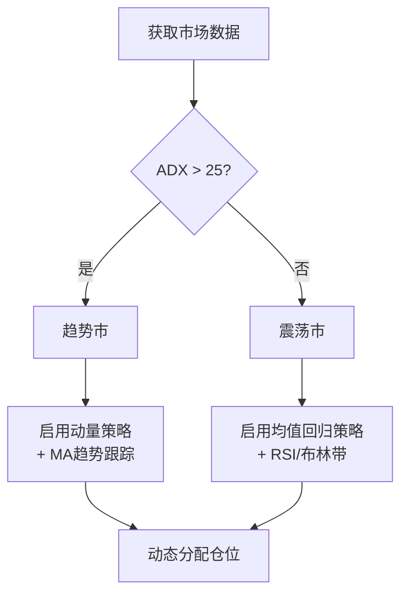

# 🔄 均值回归与动量策略

> [!info] 本节定位
> 趋势策略赚的是"大波段"，均值回归赚的是"来回摆动"，动量策略赚的是"强者恒强"。三者互补，组合使用效果最佳。

---

## 一、均值回归 vs 动量 — 核心哲学

> [!tip] 两种哲学的直觉类比
> - **均值回归 = 橡皮筋**：拉得越远，弹回越快。**价格偏离均值 → 回归**
> - **动量策略 = 滚雪球**：下坡越滚越快。**涨的继续涨，跌的继续跌**
>
> 口诀：
> - 均值回归 → **逆势**（跌多买、涨多卖）
> - 动量策略 → **顺势**（追涨杀跌）

| 维度 | 均值回归 | 动量策略 |
|------|---------|---------|
| **核心假设** | 价格偏离均值后会回归 | 上涨的会继续涨，下跌的会继续跌 |
| **买入时机** | 价格**过度下跌**时买入 | 价格**持续上涨**时买入 |
| **卖出时机** | 价格回到均值附近 | 上涨动能衰减时 |
| **适用市场** | 震荡市、区间交易 | 趋势市、单边行情 |
| **持仓周期** | 短（几天到几周） | 中长（几周到几月） |
| **胜率** | 高（60-70%） | 低（30-40%） |
| **盈亏比** | 低（1:1 左右） | 高（2:1 以上） |

> [!important] 关键洞察
> 均值回归和动量策略是**天然对冲**的。趋势市里动量策略赚钱、均值回归亏钱；震荡市则相反。这就是为什么**组合使用**能平滑资金曲线。

---

## 二、均值回归策略

### 2.1 RSI（Relative Strength Index）策略

#### RSI 计算

```python
def calculate_rsi(data, period=14):
    delta = data['close'].diff()
    gain = delta.where(delta > 0, 0).rolling(period).mean()
    loss = (-delta.where(delta < 0, 0)).rolling(period).mean()
    rs = gain / loss
    data['rsi'] = 100 - (100 / (1 + rs))
    return data
```

#### 经典信号

| RSI 区间 | 含义 | 操作 |
|---------|------|------|
| < 30 | 超卖 | 准备做多（等确认信号） |
| 30-70 | 中性 | 观望 |
| > 70 | 超买 | 准备做空/减仓 |

#### 改进版 RSI 策略

> [!warning] 经典 RSI(14) 的问题
> RSI < 30 不代表一定反弹——强势下跌中 RSI 可以长期低于 30。

**改进方案**：

```python
# RSI 均值回归 + 趋势过滤
def rsi_mean_reversion(data, rsi_period=5, ma_period=200):
    data = calculate_rsi(data, rsi_period)
    data['ma200'] = data['close'].rolling(ma_period).mean()
    
    # 只在长期趋势向上时做多（价格在 MA200 上方）
    data['buy'] = (data['rsi'] < 20) & (data['close'] > data['ma200'])
    
    # RSI 回到 50 以上时平仓（均值回归完成）
    data['sell'] = data['rsi'] > 50
    
    return data
```

> [!tip] 参数选择
> - 短周期 RSI(5) 比 RSI(14) 更适合均值回归，因为它对超卖更敏感
> - MA(200) 趋势过滤大幅减少"接飞刀"的风险

### 2.2 布林带均值回归

详见 → [[ln-03_技术指标与趋势策略]] 第四节

核心逻辑：价格触及下轨 → 做多 → 回到中轨平仓。**必须在震荡市使用**（ADX < 20）。

### 2.3 配对交易（Pair Trading）

> [!abstract] 原理
> 找两只**高度相关**的股票（如 GOOGL 和 META），当它们的价差偏离历史均值时，做多被低估的、做空被高估的，等价差回归。

#### 实现步骤

```
1. 选择配对 → 计算协整关系（Cointegration Test）
2. 计算价差（Spread）= Stock_A - β × Stock_B
3. 标准化价差（Z-Score）= (Spread - Mean) / Std
4. 信号：
   - Z-Score < -2 → 做多 Spread（买A卖B）
   - Z-Score > +2 → 做空 Spread（卖A买B）
   - Z-Score 回到 0 附近 → 平仓
```

#### 协整检验代码

```python
from statsmodels.tsa.stattools import coint

def find_cointegrated_pairs(data_dict, significance=0.05):
    """在股票池中找协整配对"""
    tickers = list(data_dict.keys())
    pairs = []
    for i in range(len(tickers)):
        for j in range(i+1, len(tickers)):
            score, pvalue, _ = coint(
                data_dict[tickers[i]]['close'],
                data_dict[tickers[j]]['close']
            )
            if pvalue < significance:
                pairs.append((tickers[i], tickers[j], pvalue))
    return sorted(pairs, key=lambda x: x[2])
```

> [!danger] 配对交易的风险
> - 协整关系**不是永久的**，会突然失效（结构性变化）
> - 需要**定期重新检验**协整性（建议每月）
> - 做空端有**借券费**和**强制回补**风险

---

## 三、动量策略

### 3.1 时间序列动量（Time-Series Momentum）

> [!abstract] 原理
> 看单只股票自己的历史表现：过去涨的继续做多，过去跌的做空/不持有。

```python
def time_series_momentum(data, lookback=60, hold=20):
    """
    lookback: 回看期（判断趋势的窗口）
    hold: 持有期
    """
    # 过去 lookback 天的收益率
    data['momentum'] = data['close'].pct_change(lookback)
    
    # 正动量 → 做多，负动量 → 不持有（只做多版本）
    data['signal'] = (data['momentum'] > 0).astype(int)
    
    return data
```

### 3.2 截面动量（Cross-Sectional Momentum）

> [!abstract] 原理
> 比较**多只股票**之间的相对强弱，买入最强的，卖出最弱的。

```python
def cross_sectional_momentum(returns_df, top_n=10, lookback=60):
    """
    returns_df: DataFrame，每列是一只股票的日收益率
    top_n: 买入排名前 N 的股票
    lookback: 回看期
    """
    # 计算每只股票过去 lookback 天的累计收益
    cum_returns = (1 + returns_df).rolling(lookback).apply(
        lambda x: x.prod() - 1
    )
    
    # 每天按收益排名，取前 top_n
    rankings = cum_returns.rank(axis=1, ascending=False)
    long_signals = (rankings <= top_n).astype(int)
    
    # 等权重
    weights = long_signals.div(long_signals.sum(axis=1), axis=0)
    
    return weights
```

### 3.3 动量策略的关键参数

| 参数 | 常用范围 | 影响 |
|------|---------|------|
| **回看期** | 1-12 个月 | 太短 = 噪音多，太长 = 滞后 |
| **持有期** | 1-4 周 | 影响换手率和交易成本 |
| **股票数量** | 前 10-30 名 | 太少 = 集中风险，太多 = 稀释收益 |
| **跳过最近 1 周** | 是/否 | 避免"短期反转效应" |

> [!tip] 经典发现
> 学术研究表明，**12 个月回看期 + 跳过最近 1 个月 + 持有 1 个月** 是最稳健的动量参数。这个叫 "12-1 momentum"。

### 3.4 动量崩溃（Momentum Crash）

> [!danger] 动量策略最大的风险
> 当市场从暴跌中快速反弹时，之前的"输家"猛涨，"赢家"反而落后，动量策略会遭受**巨大亏损**。
>
> **历史案例**：
> - 2009年3月（金融危机反弹）
> - 2020年3月（COVID 反弹）
>
> **应对方法**：
> 1. 加入**波动率调整**：高波动时减小仓位
> 2. 与**均值回归策略对冲**
> 3. 设**最大回撤止损**

---

## 四、均值回归 + 动量的组合框架

### 4.1 市场状态判断



### 4.2 资金分配建议

| 市场状态 | 动量策略 | 均值回归 | 现金 |
|---------|---------|---------|------|
| 强趋势（ADX>40） | 60% | 10% | 30% |
| 弱趋势（25<ADX<40） | 40% | 30% | 30% |
| 震荡（ADX<25） | 10% | 50% | 40% |

### 4.3 推荐演进路径

> [!important] 不要一上来就组合使用
> 先跑通一个策略再叠加第二个，否则亏钱时不知道是哪个策略的问题。

1. **第一步**：专精**动量策略**（升级现有 MA 交叉，加趋势过滤 + 成交量 + ATR）
2. **第二步**：加入简单的 **RSI 均值回归** 作为对冲，各分 50% 资金
3. **第三步**：用 **ADX** 动态切换两种策略（成熟阶段再做）

---

## 五、自测清单

> [!question] 学完本节，你应该能回答：

- [ ] 均值回归和动量策略的核心假设分别是什么？
- [ ] RSI 经典策略的问题是什么？如何用趋势过滤改进？
- [ ] 配对交易的基本步骤是什么？最大风险是什么？
- [ ] 时间序列动量和截面动量的区别？
- [ ] 什么是"动量崩溃"？如何应对？
- [ ] 为什么均值回归和动量策略适合组合使用？
- [ ] ADX 如何帮助判断该用哪种策略？

---

## 相关笔记

- [[ln-03_技术指标与趋势策略]] — 上一节
- [[ln-05_多因子模型与基本面量化]] — 下一节
- [[ln-01_美股量化系统_知识图谱与搭建路线图]] — 总路线图
- [[dev-03-策略设计]] — 代码实现
