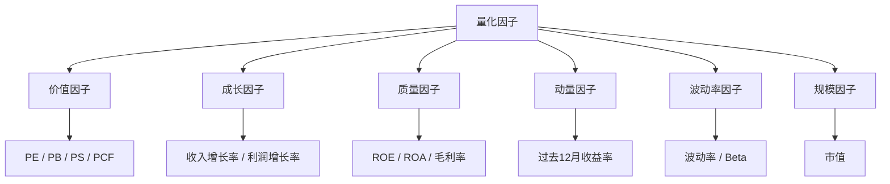

# 📊 多因子模型与基本面量化

> [!info] 本节定位
> 从"看K线做交易"升级到"用数据选股票"。多因子模型是机构量化的核心方法论，也是路线图 Phase 3 Level 3 的内容。

---

## 一、什么是因子（Factor）？

> [!abstract] 定义
> 因子 = 能够**系统性地解释股票收益差异**的特征。
> 如果一个因子有效，那么按该因子排序的股票，排名靠前的组平均收益应该显著高于排名靠后的组。

### 经典因子分类



---

## 二、常用因子详解

### 2.1 价值因子

| 因子 | 公式 | 逻辑 | 陷阱 |
|------|------|------|------|
| **PE（市盈率）** | 股价 / EPS | PE 低 → 便宜 → 买入 | 亏损股 PE 为负，需剔除 |
| **PB（市净率）** | 股价 / 每股净资产 | PB 低 → 资产打折 → 买入 | 轻资产公司 PB 天然高 |
| **PS（市销率）** | 市值 / 总收入 | PS 低 → 营收被低估 | 亏损公司也适用 |
| **EV/EBITDA** | 企业价值 / EBITDA | 剔除资本结构影响，更公允 | 计算复杂 |

> [!warning] 价值陷阱（Value Trap）
> 便宜的股票可能有便宜的理由（业务恶化、行业衰退）。纯价值因子需要配合**质量因子**过滤。

### 2.2 质量因子

| 因子 | 公式 | 逻辑 |
|------|------|------|
| **ROE（净资产收益率）** | 净利润 / 净资产 | 高 ROE = 赚钱效率高 |
| **ROA（总资产收益率）** | 净利润 / 总资产 | 排除杠杆影响 |
| **毛利率** | 毛利 / 收入 | 高毛利 = 定价权强 |
| **资产负债率** | 总负债 / 总资产 | 低负债 = 财务稳健 |
| **应计利润比率** | (净利润 - 经营现金流) / 总资产 | 低 = 利润质量高（现金实在） |

### 2.3 成长因子

| 因子 | 计算 | 逻辑 |
|------|------|------|
| **收入增长率** | (本期收入 - 上期收入) / 上期收入 | 营收扩张 |
| **净利润增长率** | 同上逻辑 | 盈利扩张 |
| **EPS 增长率** | 同上逻辑 | 每股盈利扩张 |
| **分析师上调** | 一致预期 EPS 上调次数 | 市场预期改善 |

### 2.4 动量因子

详见 → [[ln-04_均值回归与动量策略]]

| 因子 | 计算 | 逻辑 |
|------|------|------|
| **12-1 动量** | 过去12个月收益率（剔除最近1个月） | 强者恒强 |
| **短期反转** | 过去1个月收益率（取反） | 短期超跌反弹 |

---

## 三、多因子选股流程

### 3.1 标准化流程


### 3.2 因子标准化

> [!important] 为什么要标准化？
> PE 的值可能是 10-50，ROE 是 5%-30%，动量是 -20%~+50%，量纲不同无法直接相加。

```python
def zscore_normalize(factor_series):
    """Z-Score 标准化：均值为 0，标准差为 1"""
    return (factor_series - factor_series.mean()) / factor_series.std()

def rank_normalize(factor_series):
    """排名标准化：转化为百分位排名 [0, 1]"""
    return factor_series.rank(pct=True)
```

### 3.3 因子合成

| 方法 | 说明 | 优缺点 |
|------|------|--------|
| **等权加权** | 每个因子权重相同 | 简单，不易过拟合 |
| **IC 加权** | 按因子 IC（预测力）分配权重 | 更精确，但需要回测 |
| **机器学习** | 用 XGBoost 等模型学习因子权重 | 效果最好，但过拟合风险最高 |

```python
def composite_score(factors_df, weights=None):
    """
    factors_df: DataFrame, 每列是一个标准化后的因子
    weights: dict, 因子权重，默认等权
    """
    if weights is None:
        weights = {col: 1/len(factors_df.columns) 
                   for col in factors_df.columns}
    
    score = sum(factors_df[col] * w for col, w in weights.items())
    return score
```

### 3.4 选股与调仓

```python
def select_stocks(score_series, top_n=20):
    """选取综合得分最高的 top_n 只股票"""
    return score_series.nlargest(top_n).index.tolist()
```

- **调仓频率**：月度（推荐）或季度
- **调仓成本**：每次调仓的换手率 × 单次交易成本
- **调仓时机**：避开财报发布日前后（信息不对称）

---

## 四、财报事件驱动策略

### 4.1 Earnings Surprise（财报超预期）

> [!abstract] 原理
> 当公司实际 EPS **超过**分析师一致预期时，股价往往会在财报后**持续上涨**（Post-Earnings Announcement Drift, PEAD）。

```
SUE = (实际EPS - 预期EPS) / 标准差

SUE > 0 → 超预期 → 做多
SUE < 0 → 不及预期 → 回避/做空
```

### 4.2 PEAD 策略实现

```python
def pead_strategy(earnings_data, hold_days=60):
    """
    earnings_data: 含 actual_eps, expected_eps, report_date
    hold_days: 财报后持有天数
    """
    earnings_data['surprise'] = (
        (earnings_data['actual_eps'] - earnings_data['expected_eps']) /
        earnings_data['expected_eps'].abs()
    )
    
    # 超预期 > 5% → 做多，持有 hold_days 天
    earnings_data['signal'] = (earnings_data['surprise'] > 0.05).astype(int)
    
    return earnings_data
```

> [!tip] 数据来源
> - 分析师预期数据：可通过长桥 API 或 Yahoo Finance 获取
> - 财报日期：`exchange_calendars` 不含财报日，需要额外数据源

### 4.3 其他财报事件

| 事件 | 策略逻辑 |
|------|---------|
| **业绩指引上调** | 公司上调未来业绩预期 → 做多 |
| **分析师评级上调** | 多家分析师上调评级 → 做多 |
| **内部人买入** | 高管增持 → 利好信号 |
| **股票回购** | 公司宣布回购 → 中期利好 |

---

## 五、因子评估指标

### 5.1 如何判断一个因子有效？

| 指标 | 全称 | 含义 | 合格线 |
|------|------|------|--------|
| **IC** | Information Coefficient | 因子值与未来收益的相关性 | \|IC\| > 0.03 |
| **IC_IR** | IC 的信息比率 | IC的均值/标准差 | > 0.5 |
| **多空收益** | Long-Short Return | Top组 - Bottom组的收益 | > 10%/年 |
| **单调性** | Monotonicity | 分组收益是否单调递增 | 越单调越好 |
| **换手率** | Turnover | 每期换仓比例 | < 30%/月 |

### 5.2 因子衰减

> [!warning] 因子会失效
> 一个因子被发现后，随着越来越多人使用，其超额收益会逐渐衰减（因子拥挤）。
>
> **应对**：
> 1. 持续监控因子 IC 的滚动值
> 2. 多因子组合分散风险
> 3. 探索新的另类因子

---

## 六、自测清单

> [!question] 学完本节，你应该能回答：

- [ ] 什么是"因子"？举出三个不同类别的因子
- [ ] 价值因子的主要风险是什么？如何应对？
- [ ] 为什么因子需要标准化？常用的标准化方法有哪些？
- [ ] 多因子选股的完整流程是什么？
- [ ] PEAD 是什么？Earnings Surprise 策略的核心逻辑？
- [ ] IC 和 IC_IR 分别衡量什么？合格线是多少？
- [ ] 因子为什么会衰减？如何应对？

---

## 相关笔记

- [[ln-04_均值回归与动量策略]] — 上一节
- [[ln-06_风险管理与仓位控制]] — 下一节
- [[ln-01_美股量化系统_知识图谱与搭建路线图]] — 总路线图
- [[dev-05-风控规则]] — 风控实现
