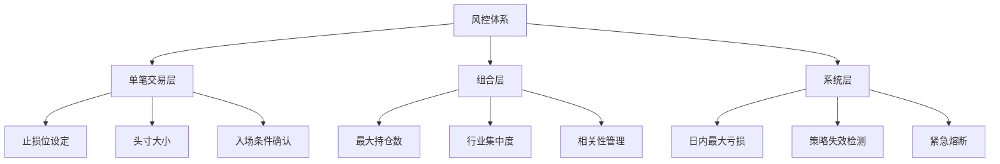

# 🛡️ 风险管理与仓位控制

> [!warning] 风控第一
> **"赚多少是能力，亏多少是命。"** 量化交易中，风控不是限制你赚钱的东西——它是让你活下来的东西。一个回撤 50% 的策略，需要涨 100% 才能回本。

---

## 一、风控体系三层架构



---

## 二、单笔交易风控

### 2.1 头寸大小计算（Position Sizing）

> [!important] 核心原则
> **单笔交易的最大亏损 ≤ 总资金的 1-2%**
> 这是量化界的共识。即使连续亏损 10 次，总资金也只减少 10-20%，还有翻盘机会。

#### 固定比例法

```python
def position_size_fixed_pct(capital, risk_pct, entry_price, stop_price):
    """
    capital: 总资金
    risk_pct: 单笔风险比例（如 0.02 = 2%）
    entry_price: 入场价
    stop_price: 止损价
    """
    risk_amount = capital * risk_pct          # 最大亏损金额
    risk_per_share = abs(entry_price - stop_price)  # 每股风险
    shares = int(risk_amount / risk_per_share)       # 可买股数
    position_value = shares * entry_price             # 仓位金额
    
    return {
        'shares': shares,
        'position_value': position_value,
        'position_pct': position_value / capital,     # 仓位占比
        'max_loss': risk_amount
    }
```

**示例**：
```
总资金 = $100,000
风险比例 = 2%（$2,000）
入场价 = $150
止损价 = $140（距离 $10）
→ 可买 200 股（仓位 $30,000 = 30%）
→ 如果触发止损，最大亏损 = $2,000 = 2%
```

#### ATR 法（推荐）

```python
def position_size_atr(capital, risk_pct, entry_price, atr, atr_mult=2):
    """
    atr: 当前 ATR 值
    atr_mult: ATR 倍数（止损距离 = atr_mult × ATR）
    """
    risk_amount = capital * risk_pct
    stop_distance = atr * atr_mult
    shares = int(risk_amount / stop_distance)
    
    return {
        'shares': shares,
        'stop_price': entry_price - stop_distance,
        'position_pct': (shares * entry_price) / capital
    }
```

> [!tip] ATR 法的优势
> 波动大的股票（如 TSLA）→ ATR 大 → 自动减少仓位
> 波动小的股票（如 KO）→ ATR 小 → 自动增加仓位
> **风险自动标准化**，不需要人为判断。

### 2.2 止损策略

| 止损类型 | 方法 | 优缺点 |
|---------|------|--------|
| **固定百分比** | 亏损 X% 止损（如 -5%） | 简单，但忽略波动率 |
| **ATR 止损** | 入场价 - N×ATR | 根据波动率自适应，推荐 |
| **技术位止损** | 跌破关键支撑位 | 合理，但需人工判断 |
| **时间止损** | 持有 N 天无盈利就退出 | 释放资金，减少机会成本 |
| **追踪止损** | 最高价回落 N% 止损 | 趋势策略锁定利润 |

> [!danger] 绝不移动止损
> 入场后如果亏损，**永远不要把止损位往下移**。这是散户最常犯的错误。量化系统必须严格执行预设止损。

### 2.3 止盈策略

| 方法 | 逻辑 | 适用场景 |
|------|------|---------|
| **固定盈亏比** | 盈利 = 2 × 止损距离 | 保证盈亏比 > 2:1，短线/均值回归 |
| **ATR 追踪止盈** | 最高价回落 N × ATR 时卖出 | 趋势策略，让利润奔跑 |
| **分批止盈** | 分阶段卖出，兼顾确定性和空间 | 通用 |
| **信号止盈** | 出现反向信号时平仓 | 灵活，但可能吐回利润 |
| **时间止盈** | 到期自动平仓 | 事件驱动策略 |

#### ATR 追踪止盈原理

> [!abstract] 核心思想
> 用 ATR（平均真实波幅）自适应设定回调容忍度。波动大的股票给宽空间，波动小的股票收紧空间。**追踪止盈线只往上移，永不下移。**

```
追踪止盈 = 持仓以来最高价 - N × ATR

AAPL ATR=$3.5, N=2 → 容忍 $7 回调（约1-2天正常波动）
TSLA ATR=$12,  N=2 → 容忍 $24 回调（不会被日常波动震出）
KO   ATR=$0.8, N=2 → 容忍 $1.6 回调（收紧保护利润）
```

ATR 倍数选择：

| 倍数 | 风格 | 适用 |
|------|------|------|
| 1× ATR | 激进 | 保利润优先，容易被正常波动震出 |
| **2× ATR** | **均衡** | 给够波动空间，大趋势能拿住 |
| 3× ATR | 保守 | 只有大幅反转才出局，利润回吐较多 |

逐日演示（META，ATR=$8）：

```
日期    最高价    ATR    追踪止盈线            操作
─────────────────────────────────────────────────
Day1    $502     $8     $502-16 = $486       买入@$500
Day2    $510     $8     $510-16 = $494 ↑     新高，止盈上移
Day3    $505     $8     $510-16 = $494       回调没跌破，继续持有
Day4    $525     $8     $525-16 = $509 ↑     新高，止盈上移
Day5    $540     $9     $540-18 = $522 ↑     波动变大，自动调整
Day6    $555     $9     $555-18 = $537 ↑     新高，止盈上移
Day7    $548     $9     $555-18 = $537       回调，没跌破
Day8    $535     $9     $555-18 = $537       跌破！→ 卖出@$537 ✅
```

### 2.4 「442 分批追踪法」⭐ Gavin 选用方案

> [!tip] 推荐给中等风险偏好
> 先落袋一部分安心，再用剩余仓位追求更大利润。兼顾**确定性**和**上涨空间**。

#### 规则定义

```
总仓位 = 100%

第一批（40%）→ 固定盈亏比 2:1 止盈（锁定确定收益）
第二批（40%）→ ATR ×2 追踪止盈（跟着趋势走）
第三批（20%）→ ATR ×3 追踪止盈（博大行情）

额外规则：第一批止盈后，剩余仓位止损上移到成本价（锁定"稳赚不赔"）
```

#### 完整参数表

| 参数 | 值 | 说明 |
|------|------|------|
| 止损距离 | 2 × ATR | 入场价 - 2×ATR |
| 单笔最大亏损 | 总资金 2% | 反算仓位大小 |
| 第一批仓位 | 40% | 固定止盈 = 入场价 + 2 × 止损距离（盈亏比 2:1） |
| 第二批仓位 | 40% | ATR ×2 追踪止盈 |
| 第三批仓位 | 20% | ATR ×3 追踪止盈 |
| 止损上移 | 第一批止盈后 → 止损移到成本价 | 保本兜底 |
| 连续亏损限制 | 3 次 | 暂停交易，人工审查 |

#### 实战演示

以 META 200 股 @$500 为例，ATR = $8：

```
止损价 = $500 - 2×$8 = $484
第一批止盈价 = $500 + 2×($500-$484) = $532

META 从 $500 涨到 $600 后回调：
```

| 价格事件 | 第一批 80股(40%) | 第二批 80股(40%) | 第三批 40股(20%) | 已锁定利润 |
|---------|----------------|----------------|----------------|-----------|
| 买入 @$500 | 持有 | 持有 | 持有 | $0 |
| 触发止盈 @$532 | **卖出 +$2,560** ✅ | 追踪=$516 | 追踪=$508 | **$2,560** |
| → 止损移到 $500 | - | 保本兜底 | 保本兜底 | - |
| 涨到 $560 | - | 追踪=$544 | 追踪=$536 | $2,560 |
| 涨到 $600 | - | 追踪=$584 | 追踪=$576 | $2,560 |
| 回落到 $582 | - | **卖出 +$6,560** ✅ | 继续持有 | **$9,120** |
| 回落到 $574 | - | - | **卖出 +$2,960** ✅ | **$12,080** |

**总利润 = $12,080（+12.1%）**

三种方法在同样行情下的对比：

| 方法 | 卖出价 | 总利润 | 评价 |
|------|--------|--------|------|
| 纯固定 2:1 | 全部@$532 | $6,400 | 踏空后面 $68 的涨幅 |
| 纯 ATR×2 追踪 | 全部@$584 | $16,800 | 赚最多，但高度依赖行情 |
| **442 分批追踪** | **分三次** | **$12,080** | **中间值，心态最稳** |

> [!important] 442 法的心理优势
> 第一批止盈后止损移到成本价，此刻你已经**稳赚不赔**——即使后面全部跌回来，最差也是保本 + 第一批利润。这让你能**拿得住**剩余仓位，不会因为恐惧提前卖出。

#### 代码实现

```python
class TakeProfitManager442:
    """442 分批追踪止盈管理器"""
    
    def __init__(self, entry_price, stop_price, atr, 
                 batch_ratios=(0.4, 0.4, 0.2),
                 tp1_rr=2, atr_mults=(2, 3)):
        self.entry = entry_price
        self.stop = stop_price
        self.atr = atr
        self.risk = entry_price - stop_price
        
        # 第一批：固定盈亏比
        self.tp1_price = entry_price + self.risk * tp1_rr
        self.batch_ratios = batch_ratios
        
        # 第二、三批：ATR 追踪
        self.atr_mults = atr_mults
        self.highest = entry_price
        self.batches_sold = [False, False, False]
    
    def update(self, current_high, current_low, current_atr):
        """每根K线调用一次，返回操作指令"""
        self.highest = max(self.highest, current_high)
        self.atr = current_atr
        actions = []
        
        # 止损检查（优先级最高）
        if current_low <= self.stop:
            remaining = sum(r for r, sold in 
                          zip(self.batch_ratios, self.batches_sold) if not sold)
            if remaining > 0:
                actions.append(('STOP_LOSS', remaining, self.stop))
            return actions
        
        # 第一批：固定止盈
        if not self.batches_sold[0] and current_high >= self.tp1_price:
            self.batches_sold[0] = True
            actions.append(('TP1_FIXED', self.batch_ratios[0], self.tp1_price))
            # 止损上移到成本价
            self.stop = self.entry
        
        # 第二批：ATR×2 追踪
        if self.batches_sold[0] and not self.batches_sold[1]:
            trailing_2 = self.highest - self.atr_mults[0] * self.atr
            if current_low <= trailing_2:
                self.batches_sold[1] = True
                actions.append(('TP2_TRAILING', self.batch_ratios[1], trailing_2))
        
        # 第三批：ATR×3 追踪
        if self.batches_sold[1] and not self.batches_sold[2]:
            trailing_3 = self.highest - self.atr_mults[1] * self.atr
            if current_low <= trailing_3:
                self.batches_sold[2] = True
                actions.append(('TP3_TRAILING', self.batch_ratios[2], trailing_3))
        
        return actions

# 使用示例
tp = TakeProfitManager442(
    entry_price=500, stop_price=484, atr=8
)

# 每根K线更新
actions = tp.update(current_high=535, current_low=528, current_atr=8)
# → [('TP1_FIXED', 0.4, 532)]  第一批止盈触发
```

---

## 三、组合层风控

### 3.1 持仓分散

| 规则 | 参数 | 说明 |
|------|------|------|
| **最大持仓数** | 5-20 只 | 太少集中风险，太多稀释收益 |
| **单只最大仓位** | ≤ 20% | 单只股票不超过总资金 20% |
| **单行业最大仓位** | ≤ 30% | 避免行业集中风险 |
| **总仓位上限** | ≤ 80% | 保留 20% 现金应对黑天鹅 |

### 3.2 相关性管理

> [!warning] 分散 ≠ 不相关
> 持有 10 只科技股看似分散，但它们高度相关——大盘跌时全跌。

```python
import numpy as np

def portfolio_risk_check(returns_df, max_correlation=0.7):
    """检查持仓间的相关性"""
    corr_matrix = returns_df.corr()
    
    # 找出相关性过高的配对
    high_corr_pairs = []
    for i in range(len(corr_matrix)):
        for j in range(i+1, len(corr_matrix)):
            if abs(corr_matrix.iloc[i, j]) > max_correlation:
                high_corr_pairs.append((
                    corr_matrix.index[i],
                    corr_matrix.columns[j],
                    corr_matrix.iloc[i, j]
                ))
    
    return high_corr_pairs
```

### 3.3 最大回撤控制

```python
def max_drawdown(equity_curve):
    """计算最大回撤"""
    peak = equity_curve.cummax()
    drawdown = (equity_curve - peak) / peak
    return drawdown.min()

def drawdown_circuit_breaker(equity_curve, threshold=-0.15):
    """
    回撤熔断：回撤超过阈值时全部平仓
    threshold: -0.15 = 15% 最大回撤
    """
    current_dd = max_drawdown(equity_curve)
    if current_dd < threshold:
        return "STOP_ALL"  # 触发熔断，清空所有持仓
    return "CONTINUE"
```

---

## 四、系统层风控

### 4.1 日内风控

| 规则 | 参数 | 动作 |
|------|------|------|
| **日亏损限额** | 总资金 -3% | 当天停止交易 |
| **连续亏损** | 连续 5 笔亏损 | 暂停策略，人工审查 |
| **单日交易次数** | ≤ 10 次 | 防止过度交易 |
| **异常波动** | 持仓股跌 > 10% | 发出告警 |

### 4.2 策略失效检测

> [!danger] 策略不是永动机
> 任何策略都有**有效期**。市场结构变化、因子拥挤、黑天鹅事件都可能让策略失效。

检测方法：

| 指标 | 计算 | 失效标准 |
|------|------|---------|
| **滚动夏普比率** | 60 日滚动窗口 | Sharpe < 0 持续 30 天 |
| **滚动胜率** | 60 日滚动窗口 | 胜率 < 30% 持续 20 天 |
| **最大连续亏损** | 计数连续亏损次数 | > 10 次连续亏损 |
| **实盘 vs 回测偏差** | 实盘收益 / 回测收益 | 偏差 > 50% |

```python
def strategy_health_check(trade_log, window=60):
    """策略健康度检查"""
    recent = trade_log.tail(window)
    
    sharpe = recent['returns'].mean() / recent['returns'].std() * np.sqrt(252)
    win_rate = (recent['pnl'] > 0).mean()
    max_consecutive_loss = max_consecutive(recent['pnl'] < 0)
    
    health = {
        'sharpe': sharpe,
        'win_rate': win_rate,
        'max_consecutive_loss': max_consecutive_loss,
        'status': 'HEALTHY'
    }
    
    if sharpe < 0 or win_rate < 0.3 or max_consecutive_loss > 10:
        health['status'] = 'WARNING'
    
    return health
```

### 4.3 紧急熔断机制

```python
class EmergencyBreaker:
    """紧急熔断控制器"""
    
    def __init__(self, max_daily_loss_pct=0.03, max_drawdown_pct=0.15):
        self.max_daily_loss = max_daily_loss_pct
        self.max_drawdown = max_drawdown_pct
    
    def check(self, daily_pnl, total_drawdown):
        if daily_pnl < -self.max_daily_loss:
            return "HALT", "日亏损超限，停止交易"
        if total_drawdown < -self.max_drawdown:
            return "HALT", "总回撤超限，清空持仓"
        return "OK", ""
```

---

## 五、凯利公式与仓位优化

### 5.1 凯利公式（Kelly Criterion）

```
f* = (p × b - q) / b

f*: 最优仓位比例
p: 胜率
q: 败率 (1-p)
b: 盈亏比（平均盈利 / 平均亏损）
```

**示例**：
```
胜率 p = 55%，盈亏比 b = 2.0
f* = (0.55 × 2 - 0.45) / 2 = 0.325 = 32.5%

→ 理论最优仓位为 32.5%
```

> [!warning] 实战中用半凯利
> 凯利公式假设**精确知道胜率和盈亏比**，实际中有估计误差。
> **建议使用 f*/2（半凯利）**，牺牲一点收益换取大幅降低破产风险。

### 5.2 仓位管理总结

| 阶段 | 方法 | 说明 |
|------|------|------|
| **初学者** | 固定仓位（每只 10%） | 简单安全 |
| **进阶** | ATR 仓位法 | 风险标准化 |
| **高阶** | 半凯利 + ATR | 理论最优的保守版 |

---

## 六、自测清单

> [!question] 学完本节，你应该能回答：

- [ ] 为什么单笔交易最大亏损应控制在 1-2%？
- [ ] ATR 仓位法相比固定百分比止损的优势是什么？
- [ ] ATR 追踪止盈的三个关键规则是什么？
- [ ] 「442 分批追踪法」的三批分别用什么止盈方式？
- [ ] 为什么第一批止盈后要把止损移到成本价？
- [ ] 组合层面的三个关键分散规则是什么？
- [ ] 如何检测一个策略是否已经失效？
- [ ] 凯利公式是什么？为什么实战中用半凯利？
- [ ] 回撤 50% 需要涨多少才能回本？

---

## 相关笔记

- [[ln-05_多因子模型与基本面量化]] — 上一节
- [[ln-07_回测方法论与过拟合防范]] — 下一节
- [[ln-01_美股量化系统_知识图谱与搭建路线图]] — 总路线图
- [[dev-05-风控规则]] — 风控代码实现

---

> [!success] 系统已落地
> 本节的核心方法已在 2026-04-21 全部落地到量化系统：
> - **ATR 动态止损**：`src/utils/indicators.py` 的 `calc_atr`
> - **442 分批止盈**：`src/risk/stop_loss.py` 的 `_check_single_442`
> - **单笔风险反算仓位**：`src/risk/position_sizer.py` 的 `risk_based_atr` 模式
> - **按策略分级参数**：`config/risk.yaml` 的 `per_strategy_overrides`
>
> 详情见 [[dev-05-风控规则]] 和 [[dev-04-回测记录]] 的"阶段 2 升级"章节。
>
> 54 次 A/B 对比验证：新风控将 MA/RSI/Momentum 的平均 MaxDD 从 24-28% 降至 4-5%。
