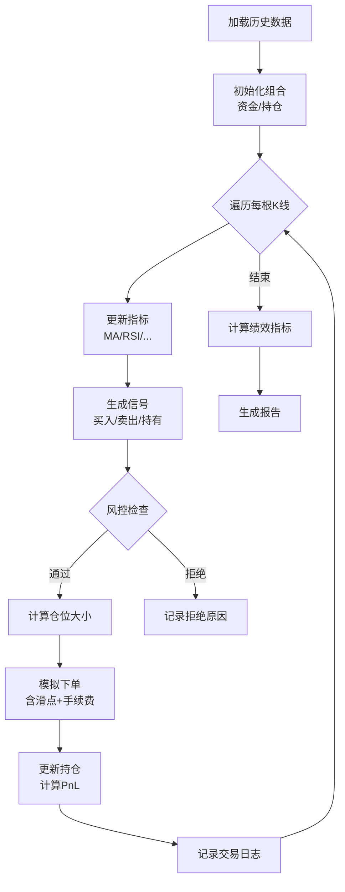

# 🧪 回测方法论与过拟合防范

> [!warning] 核心警告
> **回测是量化交易中最容易自欺欺人的环节。** 一个看起来年化 100% 的回测结果，实盘大概率亏钱。本节教你如何做"真实"的回测，以及如何识别和避免过拟合。

---

## 一、回测的核心陷阱

### 1.1 六大偏差

| 偏差 | 说明 | 后果 | 防范 |
|------|------|------|------|
| **前视偏差** | 使用了未来才知道的信息 | 回测虚高 | 严格按时间顺序，信号延迟执行 |
| **幸存者偏差** | 只用了现存股票 | 高估收益 | 使用含退市股的数据集 |
| **过拟合** | 参数针对历史数据过度调优 | 样本外失效 | Walk-Forward + 样本外测试 |
| **滑点偏差** | 假设完美成交 | 忽略成本 | 模拟真实滑点和手续费 |
| **选择偏差** | 只展示最好的回测结果 | 美化策略 | 记录所有尝试，不只展示赢家 |
| **数据窥探** | 反复测试直到找到"有效"参数 | 统计假象 | 控制试验次数，Bonferroni 校正 |

### 1.2 前视偏差的常见来源

> [!danger] 最隐蔽也最致命

```python
# ❌ 错误示范：用了未来数据
data['signal'] = data['close'] > data['close'].shift(-1)  # shift(-1) 是未来数据！

# ✅ 正确做法：信号只能基于当前和历史数据
data['signal'] = data['close'] > data['close'].shift(1)   # shift(1) 是昨天的数据

# ❌ 错误示范：当天信号当天执行
data['position'] = data['signal']  # 信号和执行在同一根K线

# ✅ 正确做法：信号次日执行
data['position'] = data['signal'].shift(1)  # 信号延迟一天执行
```

其他常见前视偏差来源：
- 使用**全样本计算**的均值/标准差做标准化（应该用滚动窗口）
- 基于**最终版**财报数据回测（应该用初始发布版，因为财报会修正）
- 用了**尚未发布**的财报数据（注意财报发布日 vs 报告期）

---

## 二、回测框架设计

### 2.1 事件驱动 vs 向量化回测

| 方式 | 说明 | 优缺点 |
|------|------|--------|
| **向量化** | 用 pandas 一次性计算所有信号 | 快，但容易引入前视偏差 |
| **事件驱动** | 逐根 K 线推进，模拟真实交易 | 慢，但更真实 |

> [!tip] 建议
> - **策略研发阶段**：用向量化回测快速验证想法（注意避免前视偏差）
> - **最终验证阶段**：用事件驱动回测确认真实性能

### 2.2 回测引擎核心流程



### 2.3 滑点和手续费模拟

```python
class CostModel:
    """真实交易成本模型"""
    
    def __init__(self):
        self.commission_per_share = 0.005  # 佣金/股
        self.min_commission = 1.0           # 最低佣金
        self.sec_fee_rate = 8e-6           # SEC Fee（卖出）
        self.slippage_pct = 0.05 / 100     # 滑点 0.05%
    
    def calculate(self, shares, price, side):
        commission = max(shares * self.commission_per_share, self.min_commission)
        sec_fee = price * shares * self.sec_fee_rate if side == 'sell' else 0
        slippage = price * shares * self.slippage_pct
        
        total = commission + sec_fee + slippage
        return total
    
    def adjusted_price(self, price, side):
        """滑点调整后的成交价"""
        if side == 'buy':
            return price * (1 + self.slippage_pct)  # 买入价偏高
        else:
            return price * (1 - self.slippage_pct)  # 卖出价偏低
```

---

## 三、绩效评估指标

### 3.1 必看指标

| 指标 | 公式 | 合格线 | 说明 |
|------|------|--------|------|
| **年化收益** | (1 + total_return)^(252/days) - 1 | > 15% | 绝对收益 |
| **超额收益** | 策略收益 - 基准收益 | > 5% | 跑赢标普 500 |
| **夏普比率** | (R_p - R_f) / σ_p × √252 | > 1.0 | 每单位风险的超额收益 |
| **最大回撤** | max(peak - trough) / peak | < 20% | 最坏情况下的亏损 |
| **Calmar 比率** | 年化收益 / 最大回撤 | > 1.0 | 收益/风险的综合指标 |
| **胜率** | 盈利交易 / 总交易 | > 40% | 配合盈亏比看 |
| **盈亏比** | 平均盈利 / 平均亏损 | > 1.5 | 每笔赚亏的比例 |
| **期望值** | 胜率 × 平均盈利 - 败率 × 平均亏损 | > 0 | 每笔交易的数学期望 |

### 3.2 绩效计算代码

```python
import numpy as np
import pandas as pd

def calculate_performance(equity_curve, risk_free_rate=0.04):
    """计算完整的绩效指标"""
    returns = equity_curve.pct_change().dropna()
    
    # 年化收益
    total_days = len(returns)
    total_return = equity_curve.iloc[-1] / equity_curve.iloc[0] - 1
    annual_return = (1 + total_return) ** (252 / total_days) - 1
    
    # 夏普比率
    excess_returns = returns - risk_free_rate / 252
    sharpe = excess_returns.mean() / excess_returns.std() * np.sqrt(252)
    
    # 最大回撤
    peak = equity_curve.cummax()
    drawdown = (equity_curve - peak) / peak
    max_dd = drawdown.min()
    
    # Calmar 比率
    calmar = annual_return / abs(max_dd) if max_dd != 0 else np.inf
    
    return {
        'total_return': f"{total_return:.2%}",
        'annual_return': f"{annual_return:.2%}",
        'sharpe_ratio': f"{sharpe:.2f}",
        'max_drawdown': f"{max_dd:.2%}",
        'calmar_ratio': f"{calmar:.2f}",
        'volatility': f"{returns.std() * np.sqrt(252):.2%}",
    }
```

---

## 四、过拟合防范

### 4.1 什么是过拟合？

> [!danger] 过拟合的本质
> 你的策略学到的不是**市场规律**，而是**历史数据的噪音**。
> 
> 类比：考试时背答案 vs 理解原理。背答案的人换一套题就不会了。

**过拟合的信号**：
- 回测结果"太好了"（年化 > 50%，夏普 > 3）
- 微调参数后结果剧烈变化
- 样本外表现与样本内差距巨大
- 策略规则过于复杂（> 5 个条件）

### 4.2 样本内/外分割

```
|←────── 样本内（In-Sample）──────→|←── 样本外（Out-of-Sample）──→|
|     用于开发和优化策略            |      用于验证策略              |
|     2020-01 ~ 2024-06            |      2024-07 ~ 2026-04        |
```

> [!important] 规则
> - 样本外数据**永远不能用于调整策略参数**
> - 样本外只能看**一次**——如果你看完结果再改策略，它就变成了样本内
> - 推荐比例：70% 样本内 + 30% 样本外

### 4.3 Walk-Forward Analysis（滚动前进分析）

> [!tip] 最推荐的验证方法

```
时间窗口滚动：

轮次1: |-- 训练 --|-- 测试 --|
轮次2:    |-- 训练 --|-- 测试 --|
轮次3:       |-- 训练 --|-- 测试 --|
轮次4:          |-- 训练 --|-- 测试 --|
...

每轮：
1. 在训练窗口优化参数
2. 用优化后的参数在测试窗口交易
3. 记录测试窗口的真实表现
4. 窗口向前滚动，重复
```

```python
def walk_forward_analysis(data, strategy_func, 
                          train_size=504, test_size=63):
    """
    Walk-Forward 分析
    train_size: 训练窗口（504天≈2年）
    test_size: 测试窗口（63天≈3个月）
    """
    results = []
    
    for start in range(0, len(data) - train_size - test_size, test_size):
        train = data.iloc[start:start + train_size]
        test = data.iloc[start + train_size:start + train_size + test_size]
        
        # 在训练集优化参数
        best_params = strategy_func.optimize(train)
        
        # 用最优参数在测试集交易
        test_result = strategy_func.backtest(test, best_params)
        results.append(test_result)
    
    # 拼接所有测试窗口的结果 = 真实的样本外表现
    return pd.concat(results)
```

### 4.4 参数稳定性检验

> [!important] 找"稳定高原"而非"尖锐山峰"

```python
def parameter_sensitivity(data, strategy_func, param_grid):
    """
    参数敏感性热力图
    param_grid: {'short_ma': [3,5,8,10,13], 'long_ma': [15,20,25,30,40]}
    """
    results = {}
    for short in param_grid['short_ma']:
        for long in param_grid['long_ma']:
            if short >= long:
                continue
            result = strategy_func.backtest(data, short_ma=short, long_ma=long)
            results[(short, long)] = result['sharpe_ratio']
    
    # 转成热力图矩阵
    # 如果周围参数的表现都类似 → 稳定高原 ✅
    # 如果只有一个点特别好 → 尖锐山峰 ❌ （过拟合）
    return results
```

### 4.5 过拟合检验清单

> [!question] 你的策略过拟合了吗？

- [ ] 策略规则是否超过 5 个条件？（越复杂越可能过拟合）
- [ ] 参数是否在邻近值处表现相似？（稳定高原 vs 尖锐山峰）
- [ ] 样本外收益是否达到样本内的 50% 以上？
- [ ] Walk-Forward 分析的结果是否一致正？
- [ ] 策略逻辑是否有合理的经济学/金融学解释？
- [ ] 换一批股票或时间段，策略是否仍然有效？

---

## 五、回测报告模板

一份合格的回测报告应包含：

```
1. 策略摘要
   - 策略名称、逻辑描述、参数设置
   
2. 绩效概览
   - 年化收益、夏普比率、最大回撤、胜率、盈亏比
   
3. 资金曲线图
   - 策略 vs 基准（SPY）的资金曲线对比
   
4. 回撤图
   - 回撤深度和持续时间
   
5. 月度收益热力图
   - 每月收益率的颜色矩阵
   
6. 交易统计
   - 总交易次数、平均持仓天数、最大连续亏损
   
7. 参数敏感性
   - 参数热力图，展示稳定性
   
8. 样本外 / Walk-Forward 结果
   - 证明策略不是过拟合
```

---

## 六、自测清单

> [!question] 学完本节，你应该能回答：

- [ ] 回测中最常见的六大偏差是什么？
- [ ] 什么是前视偏差？代码中如何避免？
- [ ] 向量化回测和事件驱动回测的区别？
- [ ] 夏普比率的公式是什么？合格线是多少？
- [ ] Walk-Forward Analysis 的原理和优势？
- [ ] 如何判断一个策略是否过拟合？
- [ ] 一份合格的回测报告应包含哪些内容？

---

## 相关笔记

- [[ln-06_风险管理与仓位控制]] — 上一节
- [[ln-08_Python量化工具链]] — 下一节
- [[ln-01_美股量化系统_知识图谱与搭建路线图]] — 总路线图
- [[dev-04-回测记录]] — 回测结果记录
