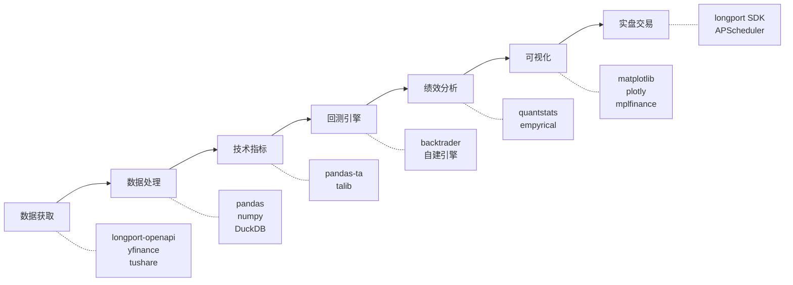

# 🐍 Python 量化工具链

> [!info] 本节定位
> 从"理论"到"代码"的桥梁。梳理搭建量化系统所需的全部 Python 工具，每个工具讲清**干什么用**、**怎么用**、**踩过什么坑**。

---

## 一、工具链全景图



---

## 二、数据获取层

### 2.1 长桥 OpenAPI（主力数据源）

```python
from longport.openapi import QuoteContext, Config

# 初始化配置
config = Config.from_env()  # 从环境变量读取 API Key
ctx = QuoteContext(config)

# 获取历史K线
from datetime import date
from longport.openapi import Period, AdjustType

candlesticks = ctx.candlesticks(
    symbol="AAPL.US",
    period=Period.Day,
    count=250,
    adjust_type=AdjustType.ForwardAdj  # 前复权
)

# 转为 DataFrame
import pandas as pd
df = pd.DataFrame([{
    'date': c.timestamp,
    'open': float(c.open),
    'high': float(c.high),
    'low': float(c.low),
    'close': float(c.close),
    'volume': int(c.volume),
    'turnover': float(c.turnover),
} for c in candlesticks])
```

> [!tip] 长桥 API 要点
> - 免费额度有限，建议做**本地缓存**避免重复请求
> - 支持美股、港股实时行情（需订阅）
> - 下单 API 在 `TradeContext` 中

### 2.2 Yahoo Finance（备用/免费数据源）

```python
import yfinance as yf

# 下载历史数据
data = yf.download("AAPL", start="2024-01-01", end="2026-04-17")

# 批量下载
data = yf.download(["AAPL", "GOOGL", "META"], start="2024-01-01")

# 获取公司信息
ticker = yf.Ticker("AAPL")
info = ticker.info              # 基本信息
financials = ticker.financials  # 财务报表
earnings = ticker.earnings_dates  # 财报日期
```

> [!warning] yfinance 的局限
> - 数据延迟（非实时）
> - 偶尔出现数据缺失或错误
> - 不能用于实盘交易
> - 适合做**回测数据补充**和**基本面研究**

### 2.3 本地数据存储

```python
import duckdb

# DuckDB：嵌入式数据库，比 SQLite 更快的分析查询
con = duckdb.connect('data/market_data.duckdb')

# 创建表
con.execute("""
    CREATE TABLE IF NOT EXISTS daily_prices (
        symbol VARCHAR,
        date DATE,
        open DOUBLE,
        high DOUBLE,
        low DOUBLE,
        close DOUBLE,
        volume BIGINT,
        PRIMARY KEY (symbol, date)
    )
""")

# 批量写入
con.execute("INSERT INTO daily_prices SELECT * FROM df")

# 快速查询
result = con.execute("""
    SELECT * FROM daily_prices 
    WHERE symbol = 'AAPL' 
    AND date >= '2025-01-01'
    ORDER BY date
""").fetchdf()
```

---

## 三、数据处理层

### 3.1 pandas 核心操作

```python
import pandas as pd
import numpy as np

# 读取数据
df = pd.read_csv('data/AAPL.csv', parse_dates=['date'], index_col='date')

# 计算收益率
df['returns'] = df['close'].pct_change()           # 日收益率
df['log_returns'] = np.log(df['close'] / df['close'].shift(1))  # 对数收益率
df['cum_returns'] = (1 + df['returns']).cumprod()   # 累计收益率

# 滚动计算
df['ma20'] = df['close'].rolling(20).mean()
df['volatility'] = df['returns'].rolling(20).std() * np.sqrt(252)

# 重采样（日线→周线）
weekly = df.resample('W').agg({
    'open': 'first', 'high': 'max', 
    'low': 'min', 'close': 'last', 
    'volume': 'sum'
})
```

### 3.2 常见数据清洗

```python
def clean_stock_data(df):
    """股票数据清洗"""
    # 1. 去除重复行
    df = df[~df.index.duplicated(keep='first')]
    
    # 2. 按时间排序
    df = df.sort_index()
    
    # 3. 处理缺失值（前向填充）
    df = df.ffill()
    
    # 4. 检测异常值（日涨跌幅 > 50%）
    returns = df['close'].pct_change()
    anomalies = returns.abs() > 0.5
    if anomalies.any():
        print(f"⚠️ 发现 {anomalies.sum()} 个异常日")
    
    # 5. 确保 OHLC 逻辑正确
    assert (df['high'] >= df['low']).all(), "High < Low 异常"
    assert (df['high'] >= df['open']).all(), "High < Open 异常"
    assert (df['high'] >= df['close']).all(), "High < Close 异常"
    
    return df
```

---

## 四、技术指标计算

### 4.1 pandas-ta（推荐）

```python
import pandas_ta as ta

# 给 DataFrame 添加技术指标
df.ta.sma(length=20, append=True)      # SMA(20)
df.ta.ema(length=12, append=True)      # EMA(12)
df.ta.rsi(length=14, append=True)      # RSI(14)
df.ta.macd(append=True)                # MACD(12,26,9)
df.ta.bbands(length=20, append=True)   # 布林带
df.ta.atr(length=14, append=True)      # ATR(14)
df.ta.adx(length=14, append=True)      # ADX(14)

# 一次性计算全部常用指标
df.ta.strategy("All")  # 上百个指标
```

> [!tip] 为什么推荐 pandas-ta
> - 纯 Python，不需要编译 TA-Lib（安装麻烦）
> - 直接和 DataFrame 集成
> - 支持 130+ 指标
> - API 设计清晰

### 4.2 自定义指标

```python
def calculate_squeeze(df, bb_length=20, kc_length=20, kc_mult=1.5):
    """
    布林带挤压指标（TTM Squeeze）
    布林带在 Keltner Channel 内部 = 挤压状态 → 准备突破
    """
    # 布林带
    bb_mid = df['close'].rolling(bb_length).mean()
    bb_std = df['close'].rolling(bb_length).std()
    bb_upper = bb_mid + 2 * bb_std
    bb_lower = bb_mid - 2 * bb_std
    
    # Keltner Channel
    atr = ta.atr(df['high'], df['low'], df['close'], length=kc_length)
    kc_mid = df['close'].rolling(kc_length).mean()
    kc_upper = kc_mid + kc_mult * atr
    kc_lower = kc_mid - kc_mult * atr
    
    # 挤压 = 布林带在 Keltner Channel 内部
    df['squeeze'] = (bb_lower > kc_lower) & (bb_upper < kc_upper)
    
    return df
```

---

## 五、回测引擎

### 5.1 backtrader（成熟框架）

```python
import backtrader as bt

class MACrossStrategy(bt.Strategy):
    params = (('short', 5), ('long', 20),)
    
    def __init__(self):
        self.ma_short = bt.ind.SMA(period=self.p.short)
        self.ma_long = bt.ind.SMA(period=self.p.long)
        self.crossover = bt.ind.CrossOver(self.ma_short, self.ma_long)
    
    def next(self):
        if self.crossover > 0:      # 金叉
            self.buy()
        elif self.crossover < 0:    # 死叉
            self.sell()

# 运行回测
cerebro = bt.Cerebro()
cerebro.addstrategy(MACrossStrategy)
cerebro.adddata(bt.feeds.PandasData(dataname=df))
cerebro.broker.setcash(100000)
cerebro.broker.setcommission(commission=0.001)
cerebro.addsizer(bt.sizers.PercentSizer, percents=95)

# 添加分析器
cerebro.addanalyzer(bt.analyzers.SharpeRatio, _name='sharpe')
cerebro.addanalyzer(bt.analyzers.DrawDown, _name='drawdown')
cerebro.addanalyzer(bt.analyzers.TradeAnalyzer, _name='trades')

results = cerebro.run()
cerebro.plot()
```

### 5.2 自建轻量回测（推荐理解原理后使用）

```python
class SimpleBacktester:
    """轻量级向量化回测器"""
    
    def __init__(self, capital=100000, commission=0.001):
        self.capital = capital
        self.commission = commission
    
    def run(self, data, signals):
        """
        data: DataFrame with 'close' column
        signals: Series of 1 (long), 0 (flat), -1 (short)
        """
        # 信号延迟一天执行
        positions = signals.shift(1).fillna(0)
        
        # 计算收益
        returns = data['close'].pct_change()
        strategy_returns = positions * returns
        
        # 扣除交易成本
        trades = positions.diff().abs()
        costs = trades * self.commission
        net_returns = strategy_returns - costs
        
        # 资金曲线
        equity = self.capital * (1 + net_returns).cumprod()
        
        return equity
```

---

## 六、绩效分析与可视化

### 6.1 quantstats（一键分析报告）

```python
import quantstats as qs

# 生成完整的 HTML 报告
qs.reports.html(returns, benchmark="SPY", output="report.html")

# 单独的分析
qs.stats.sharpe(returns)           # 夏普比率
qs.stats.max_drawdown(returns)     # 最大回撤
qs.stats.calmar(returns)           # Calmar 比率
qs.plots.drawdown(returns)         # 回撤图
qs.plots.monthly_heatmap(returns)  # 月度热力图
```

### 6.2 K线图可视化

```python
import mplfinance as mpf

# 绘制 K 线图 + 均线 + 成交量
mpf.plot(df, type='candle', 
         mav=(5, 20, 60),        # 均线
         volume=True,            # 成交量
         style='charles',        # 美式风格
         title='AAPL Daily',
         figsize=(15, 8))
```

---

## 七、实盘工具

### 7.1 定时任务调度

```python
from apscheduler.schedulers.blocking import BlockingScheduler

scheduler = BlockingScheduler()

@scheduler.scheduled_job('cron', hour=21, minute=25, timezone='Asia/Shanghai')
def pre_market_job():
    """盘前准备（夏令时 21:30 开盘前5分钟）"""
    update_data()
    generate_signals()
    print("盘前数据更新完成")

@scheduler.scheduled_job('cron', hour=4, minute=5, timezone='Asia/Shanghai')
def post_market_job():
    """盘后结算"""
    calculate_pnl()
    generate_report()
    send_notification()
    print("盘后结算完成")

scheduler.start()
```

### 7.2 告警通知

```python
import requests

def send_wechat_notification(message, webhook_url):
    """企业微信机器人通知"""
    data = {
        "msgtype": "text",
        "text": {"content": message}
    }
    requests.post(webhook_url, json=data)

# 交易信号通知
send_wechat_notification(
    f"📊 交易信号\n买入 AAPL @ $178.50\n仓位: 30%\n止损: $170.00",
    webhook_url="YOUR_WEBHOOK_URL"
)
```

---

## 八、推荐安装清单

```bash
# 核心依赖
pip install pandas numpy scipy

# 数据获取
pip install longport-openapi yfinance

# 技术指标
pip install pandas-ta

# 回测
pip install backtrader

# 分析与可视化
pip install quantstats matplotlib mplfinance plotly

# 数据库
pip install duckdb

# 定时任务
pip install apscheduler

# 统计检验
pip install statsmodels scikit-learn

# 日志
pip install loguru
```

---

## 九、自测清单

> [!question] 学完本节，你应该能回答：

- [ ] 长桥 API 获取K线数据的核心代码怎么写？
- [ ] yfinance 和长桥 API 的区别和各自适用场景？
- [ ] 为什么推荐 DuckDB 而不是 SQLite？
- [ ] pandas-ta 如何一行代码计算 RSI？
- [ ] backtrader 回测的基本流程是什么？
- [ ] quantstats 如何一键生成回测报告？
- [ ] 实盘系统的定时任务怎么设计？

---

## 相关笔记

- [[ln-07_回测方法论与过拟合防范]] — 上一节
- [[ln-01_美股量化系统_知识图谱与搭建路线图]] — 总路线图
- [[dev-01-环境搭建]] — 环境配置
- [[dev-00-系统概览]] — 系统架构
